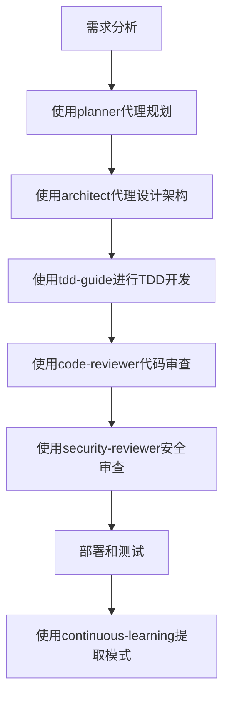

# Everything Claude Code - 入门学习指导

> **🎯 项目定位**：这是一个**Claude AI开发工具包**，专门为AI助手开发提供完整的生态系统和最佳实践

## 🚀 项目概述

### 项目是什么？
这是一个由Anthropic黑客马拉松获奖者开发的**Claude Code配置集合**，经过10+个月的实战使用和不断优化。它提供了：

- **生产就绪的代理（Agents）** - 专门处理特定任务的AI助手
- **技能（Skills）** - 工作流定义和领域知识
- **钩子（Hooks）** - 基于事件的自动化
- **命令（Commands）** - 快速执行的快捷指令
- **MCP配置** - 模型上下文协议服务器配置

### 技术栈特色
- **包管理器**：Bun（快速、现代化的JavaScript工具链）
- **语言**：TypeScript/JavaScript
- **框架**：Node.js生态系统
- **测试**：完整的测试套件
- **跨平台**：支持Windows、macOS、Linux

## 📚 学习路径（从易到难）

### 阶段1：基础入门（1-2天）

#### 1.1 理解核心概念
- **代理（Agents）**：专门化的AI助手，如代码审查员、架构师、安全审查员
- **技能（Skills）**：可重用的工作流模式，如后端模式、TDD工作流
- **命令（Commands）**：快速执行的快捷指令，如`/tdd`、`/code-review`

#### 1.2 项目结构认知
```
everything-claude-code/
├── agents/           # 专业化代理
├── skills/           # 技能和工作流
├── commands/         # 快捷命令
├── hooks/           # 自动化钩子
├── scripts/         # Node.js脚本
├── tests/           # 测试套件
└── rules/           # 开发规则
```

#### 1.3 环境配置
```bash
# 检测当前包管理器
node scripts/setup-package-manager.js --detect

# 设置Bun为项目包管理器
node scripts/setup-package-manager.js --project bun

# 运行测试验证环境
node tests/run-all.js
```

### 阶段2：核心组件掌握（3-5天）

#### 2.1 代理系统深入
**主要代理类型：**
- `planner.md` - 功能实现规划
- `architect.md` - 系统架构设计
- `code-reviewer.md` - 代码质量审查
- `security-reviewer.md` - 安全漏洞分析
- `tdd-guide.md` - 测试驱动开发指导

**学习重点：**
- 理解每个代理的职责边界
- 学习如何组合使用多个代理
- 掌握代理间的协作模式

#### 2.2 技能系统实践
**核心技能领域：**
- **后端模式**：API设计、数据库优化、缓存策略
- **前端模式**：React、Next.js最佳实践
- **安全审查**：安全检查清单和漏洞检测
- **持续学习**：从会话中自动提取模式

**实践建议：**
- 阅读`skills/backend-patterns/SKILL.md`学习架构模式
- 尝试实现一个简单的技能

#### 2.3 命令系统使用
**常用命令：**
- `/tdd` - 启动测试驱动开发流程
- `/plan` - 制定实现计划
- `/code-review` - 执行代码审查
- `/setup-pm` - 配置包管理器

### 阶段3：高级特性探索（1-2周）

#### 3.1 钩子机制（Hooks）
钩子是基于事件的自动化系统，在特定时机触发：
- **PreToolUse** - 工具使用前
- **PostToolUse** - 工具使用后
- **Stop** - 会话结束时

**学习重点：**
- 理解钩子的触发时机
- 学习编写自定义钩子
- 掌握钩子的配置方法

#### 3.2 MCP集成
MCP（模型上下文协议）允许Claude与外部服务交互：
- GitHub集成
- Supabase数据库
- Vercel部署
- Railway云服务

#### 3.3 内存持久化
学习如何在不同会话间保持上下文：
- 会话状态保存和恢复
- 模式提取和重用
- 上下文管理策略

## 🛠️ 实践项目建议

### 项目1：个人博客系统
**目标：** 应用后端模式和TDD工作流
**技术栈：** Next.js + Supabase + TypeScript
**学习重点：**
- 使用`backend-patterns`技能设计API
- 应用`tdd-workflow`进行测试驱动开发
- 使用`code-reviewer`进行代码质量检查

### 项目2：任务管理应用
**目标：** 实践前端模式和状态管理
**技术栈：** React + Zustand + TailwindCSS
**学习重点：**
- 应用`frontend-patterns`技能
- 使用`security-reviewer`进行安全检查
- 实践`continuous-learning`技能

### 项目3：API网关服务
**目标：** 掌握微服务架构和API设计
**技术栈：** Node.js + Express + Redis
**学习重点：**
- 深入理解`backend-patterns`中的设计模式
- 应用缓存策略和性能优化
- 实现认证授权系统

## 🔧 开发工作流

### 标准开发流程


### 质量保证流程
1. **代码规范检查** - 遵循`rules/coding-style.md`
2. **安全审查** - 应用`rules/security.md`
3. **测试覆盖** - 达到80%+覆盖率要求
4. **性能优化** - 遵循`rules/performance.md`

## 📖 学习资源

### 官方指南
- **简版指南**：设置、基础、哲学（先读这个）
- **详细指南**：令牌优化、内存持久化、评估、并行化

### 技术文档
- **API设计模式**：RESTful、GraphQL最佳实践
- **数据库优化**：查询优化、N+1问题预防
- **缓存策略**：Redis缓存层、缓存旁路模式

### 社区资源
- GitHub仓库：问题讨论和贡献指南
- Twitter/X：项目更新和最佳实践分享

## 🚨 常见问题解决

### 环境配置问题
**问题：** 包管理器检测失败
**解决：**
```bash
# 手动设置环境变量
export CLAUDE_PACKAGE_MANAGER=bun

# 或使用全局配置
node scripts/setup-package-manager.js --global bun
```

### 上下文窗口管理
**问题：** 上下文窗口过小
**解决：**
- 限制启用的MCP服务器数量（<10个）
- 控制活动工具数量（<80个）
- 使用`disabledMcpServers`禁用不需要的服务

### 性能优化
**建议：**
- 优先使用语义搜索（`codebase_search`）
- 对大文件使用`view_code_item`而非`read_file`
- 合理使用工具批处理

## 🎯 学习目标检查清单

### 初级目标（完成标志）
- [ ] 理解项目结构和核心概念
- [ ] 能够配置开发环境
- [ ] 掌握基本命令的使用
- [ ] 完成一个简单项目的开发

### 中级目标（完成标志）
- [ ] 熟练使用多个代理协作
- [ ] 能够自定义技能和工作流
- [ ] 理解并应用钩子机制
- [ ] 掌握MCP集成方法

### 高级目标（完成标志）
- [ ] 能够设计和实现复杂系统
- [ ] 掌握性能优化和安全最佳实践
- [ ] 能够贡献代码和改进项目
- [ ] 指导他人使用该项目

## 💡 进阶学习建议

### 1. 源码阅读策略
- 从`scripts/`目录开始，理解工具链实现
- 阅读`skills/`中的模式文档，学习架构思想
- 分析`hooks/`机制，理解自动化原理

### 2. 实践项目选择
- 选择与个人兴趣相关的项目
- 从简单到复杂逐步提升难度
- 注重代码质量和最佳实践

### 3. 社区参与
- 关注GitHub仓库的更新
- 参与问题讨论和功能建议
- 考虑贡献代码或文档

## 📈 持续学习路径

### 短期（1个月）
- 掌握所有核心概念和工具
- 完成2-3个实践项目
- 建立个人开发工作流

### 中期（3个月）
- 深入理解架构设计模式
- 能够解决复杂技术问题
- 开始贡献代码和改进

### 长期（6个月+）
- 成为项目专家
- 能够指导他人学习
- 参与项目发展方向规划

---

## 🎉 开始你的学习之旅！

记住，学习这个项目的核心价值在于：
1. **掌握AI辅助开发的最佳实践**
2. **学习现代软件架构模式**
3. **建立高质量代码的开发习惯**
4. **加入一个活跃的开发社区**

**下一步行动建议：**
1. 阅读项目的README.md获取完整概述
2. 运行测试套件验证环境配置
3. 尝试使用`/tdd`命令开始第一个项目
4. 加入社区讨论和分享经验

祝你学习愉快！🚀