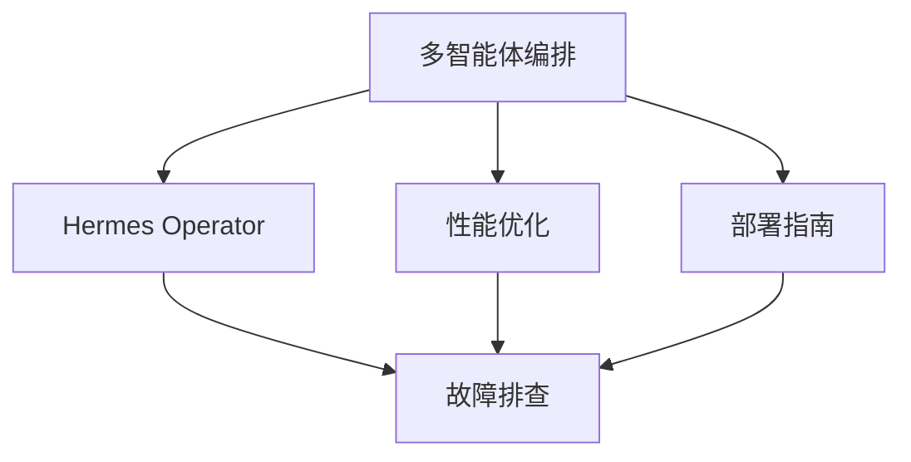

# 🚀 高级主题

深入学习 ECC 的高阶玩法：

- [🎭 多智能体编排](multi-agent) — orch-* 编排器家族实战
- [⚡ 性能优化](performance) — 性能技能族与基准测试
- [🔧 故障排查](troubleshooting) — 常见问题快速修复
- [🎯 Hermes Operator](hermes-operator) — 跨 AI 框架操作员（v2.0.0）
- [🚀 部署指南](deployment-guide) — Docusaurus 站点双平台部署

如果你已经熟悉基础功能，建议从 **多智能体编排** 开始，体验 v2.0.0 的 `orch-*` 家族带来的生产力提升。

## 推荐学习路径

## 按角色推荐

| 角色 | 推荐起点 | 核心收获 |
|------|----------|----------|
| **架构师 / Tech Lead** | [Hermes Operator](hermes-operator) | 跨框架设计、MCP 集成 |
| **全栈开发** | [多智能体编排](multi-agent) | `orch-*` 工作流自动化 |
| **性能工程师** | [性能优化](performance) | 性能技能族、基准循环 |
| **DevOps / SRE** | [部署指南](deployment-guide) + [故障排查](troubleshooting) | 部署运维实战 |
| **AI Agent 研究者** | [Hermes Operator](hermes-operator) | session 适配器、跨 harness 协议 |
