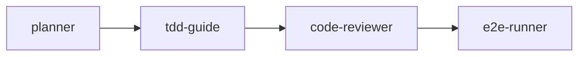
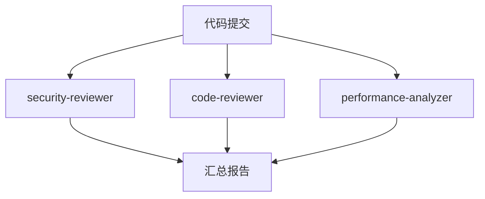
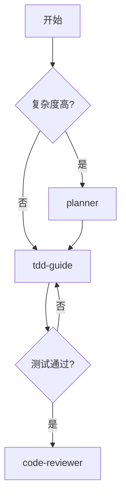

# 🎭 多智能体编排

学习如何组合多个智能体形成强大的工作流，就像指挥一个专家团队协同作战。

## 为什么需要多智能体？

单个智能体就像 **单打独斗的专家**，而多智能体编排就像 **组建一个专业团队**：

- 🏗️ **Planner** 制定计划
- 🧪 **TDD Guide** 执行开发
- 🔍 **Code Reviewer** 审查质量
- 🎯 **E2E Runner** 验证功能

## 编排模式

### 模式 1：顺序编排



**适用场景**：标准功能开发流程

```bash
# 顺序执行
/plan 实现购物车      # Step 1
/tdd --feature=cart   # Step 2
/code-review          # Step 3
/e2e 测试购物流程      # Step 4
```

### 模式 2：并行编排



**适用场景**：多维度代码审查

### 模式 3：条件编排



**适用场景**：根据条件选择不同路径

## 实战案例

### 案例 1：完整功能开发

```bash
# 1. 需求分析和规划
/plan 实现用户认证系统

# 等待确认后...

# 2. 架构设计（复杂功能）
/architect 设计认证架构

# 3. TDD 开发
/tdd --feature="auth-login"
/tdd --feature="auth-register"
/tdd --feature="auth-logout"

# 4. 代码审查
/code-review src/auth/

# 5. 安全审计
/security src/auth/

# 6. 端到端测试
/e2e 测试完整认证流程

# 7. 性能检查
/perf --module=auth
```

### 案例 2：Bug 修复流程

```bash
# 1. 调试分析
/debug TypeError: Cannot read property 'user' of undefined

# 2. TDD 修复（先写复现测试）
/tdd --feature="fix-null-user"

# 3. 代码审查
/code-review

# 4. 回归测试
/e2e 测试受影响的流程
```

### 案例 3：大规模重构

```bash
# 1. 架构评估
/architect 评估当前架构问题

# 2. 制定重构计划
/plan 重构数据访问层

# 3. 并行审查当前代码
# （多个智能体同时工作）
/code-review src/repositories/
/security src/repositories/
/perf src/repositories/

# 4. 逐步重构
/tdd --feature="refactor-user-repo"
/tdd --feature="refactor-order-repo"

# 5. 全面测试
/e2e 回归测试所有功能
```

## 最佳实践

### 1. 规划先行

```bash
# ✅ 复杂功能总是先规划
/plan 功能描述

# ❌ 直接开始编码
直接写代码...
```

### 2. 及时审查

```bash
# ✅ 写完代码立即审查
/code-review

# ❌ 积累大量代码再审查
写 1000 行后再审查...
```

### 3. 自动化测试

```bash
# ✅ TDD 保证质量
/tdd --feature="功能"

# ❌ 功能完成后补测试
写完功能再补测试...
```

## 高级技巧

### 并行任务执行

对于独立的任务，可以并行执行多个智能体：

```markdown
同时启动 3 个智能体：
1. Agent 1: 安全审查 auth 模块
2. Agent 2: 性能分析 cache 系统
3. Agent 3: 类型检查 utilities
```

### 多视角分析

对于复杂问题，使用多个角色进行分析：

- 👨‍💻 **高级工程师视角**：代码质量
- 🔒 **安全专家视角**：安全漏洞
- ⚡ **性能专家视角**：性能瓶颈
- 📝 **文档专家视角**：可维护性

---

💡 **提示**：多智能体编排的关键是 **明确每个智能体的职责边界**，避免重复工作！
