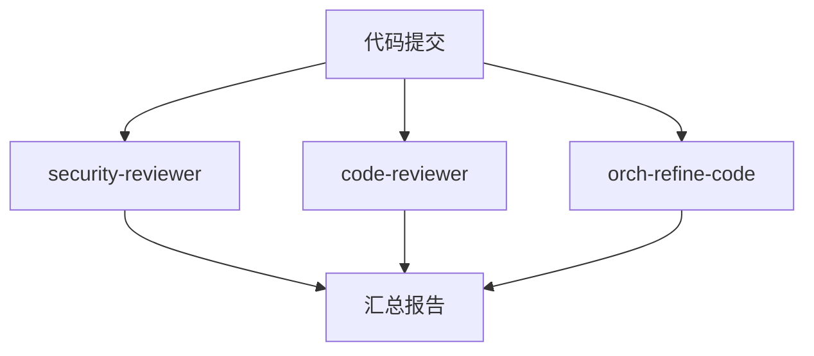

# 🎭 多智能体编排

学习如何用 ECC 的 **`orch-*` 编排器家族**组合多个智能体形成强大的工作流，就像指挥一个专家团队协同作战。ECC v2.0.0 提供了 6 个编排器命令，覆盖 MVP 构建、功能添加、缺陷修复、代码优化、变更改造、管道编排。

## 为什么需要多智能体编排？

单个智能体就像 **单打独斗的专家**，而多智能体编排就像 **组建一个专业团队**：

- 🏗️ **planner** 制定计划
- 🧪 **tdd-guide** 执行开发
- 🔍 **code-reviewer** 审查质量
- 🎯 **e2e-runner** 验证功能
- 🛡️ **security-reviewer** 安全审计

v2.0.0 的 `orch-*` 命令把这些流程**产品化** —— 不再需要手动串联多个 agent。

## `orch-*` 编排器家族（v2.0.0 新增）

| 命令 | 用途 | 适用场景 |
|------|------|----------|
| `/orch-build-mvp` | 快速构建 MVP | 0 → 1 新项目、原型验证 |
| `/orch-add-feature` | 添加新功能 | 在现有代码库加入独立功能 |
| `/orch-fix-defect` | 修复缺陷 | Bug 定位、修复、回归测试 |
| `/orch-refine-code` | 重构优化 | 性能调优、代码质量改进 |
| `/orch-change-feature` | 修改现有功能 | 已有功能的参数/行为变更 |
| `/orch-pipeline` | 自定义编排 | 自由组合多 agent 流水线 |

## 编排模式

### 模式 1：单命令编排（推荐起点）

```mermaid
graph LR
    A[/orch-build-mvp] --> B[planner]
    B --> C[architect]
    C --> D[tdd-guide]
    D --> E[code-reviewer]
    E --> F[e2e-runner]
```

**适用场景**：标准 MVP 构建

```bash
/orch-build-mvp "Todo app with React + Node.js + PostgreSQL"
```

编排器会自动调度：planner → architect → tdd-guide → code-reviewer → e2e-runner，并在每一步等待你的确认。

### 模式 2：分阶段编排

```mermaid
graph LR
    A[/orch-build-mvp 基础] --> B[/orch-add-feature 认证]
    B --> C[/orch-add-feature 支付]
    C --> D[/orch-refine-code 性能]
```

**适用场景**：大型项目渐进式构建

```bash
# Step 1：MVP
/orch-build-mvp "todo app base"

# Step 2-N：迭代添加功能
/orch-add-feature "user authentication"
/orch-add-feature "payment integration"
/orch-add-feature "email notifications"

# 最后：性能优化
/orch-refine-code --focus=performance
```

### 模式 3：并行多视角审查


```mermaid
graph TD
    A[代码提交] --> B[security-reviewer]
    A --> C[code-reviewer]
    A --> D[orch-refine-code]
    B --> E[汇总报告]
    C --> E
    D --> E
```

**适用场景**：多维度代码审查

```bash
# 三路并行审查
/code-review src/auth/         # 代码质量
/security-scan src/auth/       # 安全审计
/orch-refine-code --module=auth  # 性能与可维护性
```

### 模式 4：自定义流水线

```bash
/orch-pipeline --steps="plan,tdd,review,e2e" \
  --feature="payment-gateway" \
  --gate=strict
```

## 实战案例

### 案例 1：从零构建完整功能（v2.0.0 推荐路径）

```bash
# 1. MVP 构建（含规划+架构+TDD+审查+E2E）
/orch-build-mvp "Real-time chat with React + WebSocket + Node.js"

# 2. 迭代添加功能（每个都是完整闭环）
/orch-add-feature "user authentication with OAuth2"
/orch-add-feature "message persistence"
/orch-add-feature "file attachments"

# 3. 性能优化
/orch-refine-code --focus=performance

# 4. 安全审查
/orch-pipeline --steps="security-scan,review-pr"
```

### 案例 2：Bug 修复闭环

```bash
# 一键缺陷修复（含定位 → 复现测试 → 修复 → 回归）
/orch-fix-defect "登录后 session 立即失效"

/orch-fix-defect 内部会：
#   1. silent-failure-hunter 定位问题
#   2. tdd-guide 写复现测试
#   3. code-reviewer 修复实现
#   4. e2e-runner 跑回归
```

### 案例 3：大规模重构

```bash
# 1. 先评估当前代码
/plan 评估数据访问层架构问题

# 2. 改造现有功能
/orch-change-feature "将 UserRepository 从 MyBatis 切换到 JPA"

/orch-change-feature 内部会：
#   - planner 制定迁移计划
#   - tdd-guide 写兼容性测试
#   - code-reviewer 分阶段切换
#   - e2e-runner 验证完整性

# 3. 优化质量
/orch-refine-code --module=repositories
```

### 案例 4：完整流水线（多步并行）

```bash
# 同时启动 3 个智能体：
# 1. 安全审查
# 2. 代码质量审查
# 3. 性能分析
/orch-pipeline --parallel \
  --steps="security-scan,code-review,orch-refine-code" \
  --target=src/repositories/

# 汇总 3 份报告 → 统一决策
```

### 案例 5：完整工作流对照（旧 vs 新）

**v1.x 旧模式（手动串联 7 步）：**

```bash
/plan 实现评论功能
/plan --architect 设计评论架构
/tdd --feature="comments-create"
/tdd --feature="comments-list"
/tdd --feature="comments-delete"
/code-review
/security-scan src/comments/
/e2e 测试评论流程
```

**v2.0.0 新模式（一键完成）：**

```bash
/orch-build-mvp "comments feature with CRUD + moderation"
```

或者更细粒度（推荐）：

```bash
/orch-add-feature "comments with CRUD + moderation"
```

## 多视角分析（复杂问题）

对于复杂问题，使用多个智能体并行分析：

| 视角 | Agent | 工具/技能 |
|------|-------|----------|
| 👨‍💻 高级工程师 | code-reviewer | 代码质量、最佳实践 |
| 🔒 安全专家 | security-reviewer | OWASP Top 10、依赖漏洞 |
| ⚡ 性能专家 | orch-refine-code | 基准测试、瓶颈识别 |
| 📝 文档专家 | doc-updater | API 文档、变更日志 |
| 🏗️ 架构师 | planner / architect | 架构一致性、未来扩展 |

## 多 Backend / 多 Frontend 编排（v2.0.0）

ECC 提供专门的多服务编排命令：

```bash
# 多后端服务编排（API Gateway + Auth + Payment + Notification）
/multi-backend --services=api,auth,payment,notify

# 多前端应用编排（Web + Admin + Mobile）
/multi-frontend --apps=web,admin,mobile

# 通用多服务工作流
/multi-workflow --config=multi-service.yaml

# PM2 服务生命周期
/pm2 status
/pm2 restart all
```

## 编排器最佳实践

### 1. 从粗粒度开始

```bash
# ✅ 先用 orch-build-mvp 跑通全流程
/orch-build-mvp "todo app"

# ❌ 不要一上来就拆 5 个 /orch-add-feature
/orch-add-feature "todo model"
/orch-add-feature "todo API"
/orch-add-feature "todo UI"
...
```

### 2. 按业务边界划分功能

```bash
# ✅ 一个 orch-add-feature 对应一个用户故事
/orch-add-feature "user can register via email"
/orch-add-feature "user can login via OAuth"

# ❌ 不要把无关功能打包
/orch-add-feature "auth, payment, notifications, admin panel"
```

### 3. 在关键节点审查

每个 `orch-*` 命令都会在以下节点暂停等待你确认：
- 计划生成后
- 架构决策时
- TDD 实现关键 commit 前
- 审查报告生成后

利用这些暂停点检查 AI 的决策是否符合预期。

### 4. 配合 plugin 增量更新

```bash
# 编排器生成的代码会经过 hooks 检查
# 更新插件以获取最新的编排逻辑
/plugin update ecc@ecc
```

## 编排失败时的回退

如果编排器中间步骤失败：

```bash
# 1. 查看当前进度
/sessions  # 查看当前会话历史

# 2. 从失败点继续
# 编排器会在 .orch-state/ 中保存中间状态
cat .orch-state/payment-feature.json

# 3. 手动修复后重新调度
/orch-fix-defect "继续完成 payment-gateway 集成"

# 4. 或完全重置
rm -rf .orch-state/
/orch-build-mvp "重新开始..."
```

## 编排器与 Epic 工作流

大型项目用 `epic-*` 命令管理：

```bash
# 1. 认领 Epic
/epic-claim "实现完整的电商系统"

# 2. 分解为子任务
/epic-decompose --output=epics/checkout.yaml

# 3. 用 orch-* 执行每个子 Epic
/orch-build-mvp "checkout-flow"
/orch-add-feature "inventory-sync"
/orch-add-feature "shipping-integration"

# 4. 发布
/epic-publish --pr

# 5. 审查与同步
/epic-review
/epic-sync --remote
```

## 资源

- **orch-* 命令文档**：参见 [Commands 章节](../core-concepts/commands)
- **Skills 技能库**：参见 [Skills 章节](../core-concepts/skills)
- **Agents 智能体**：参见 [Agents 章节](../core-concepts/agents)

---

💡 **提示**：`orch-*` 是 v2.0.0 的核心生产力提升 —— 把"7 步手动串联"压缩为"1 个意图描述"，让 AI 负责编排细节，你专注于业务决策。
