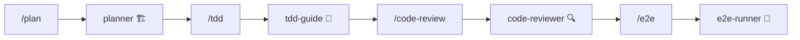

# 🤖 Agents 智能体

**Agents（智能体）** 是 ECC 的核心组件，每个智能体都是某个领域的专家，拥有特定的技能和工作流程。

## 什么是智能体？

想象智能体就像你的 **专业团队成员**：
- 🏗️ **architect** 是你的系统架构师
- 📋 **planner** 是你的项目经理
- 🧪 **tdd-guide** 是你的测试教练
- 🔍 **code-reviewer** 是你的代码审查专家

## 13 个智能体一览

| 智能体 | 用途 | 触发命令 |
|--------|------|----------|
| **planner** | 制定实施计划 | `/plan` |
| **architect** | 系统设计决策 | `/architect` |
| **tdd-guide** | 测试驱动开发 | `/tdd` |
| **code-reviewer** | 代码审查 | `/code-review` |
| **security-reviewer** | 安全分析 | `/security` |
| **build-error-resolver** | 构建错误修复 | `/build-and-fix` |
| **e2e-runner** | 端到端测试 | `/e2e` |
| **refactor-cleaner** | 死代码清理 | `/refactor` |
| **doc-updater** | 文档更新 | `/doc` |
| **git-assistant** | Git 操作 | `/git` |
| **debugger** | 调试助手 | `/debug` |
| **performance-optimizer** | 性能优化 | `/perf` |
| **dependency-manager** | 依赖管理 | `/deps` |

## 核心智能体详解

### 🏗️ planner - 规划师

**职责**：在写代码之前制定详细的实施计划

**工作流程**：
1. 重述需求，确保理解正确
2. 分析风险和依赖
3. 分阶段制定计划
4. **等待用户确认**后才开始执行

```bash
# 使用示例
/plan 实现用户认证系统
```

### 🧪 tdd-guide - TDD 教练

**职责**：引导你通过测试驱动开发

**TDD 循环**：
```
🔴 RED    → 写一个失败的测试
🟢 GREEN  → 写最少的代码让测试通过
🔵 REFACTOR → 重构代码，保持测试通过
```

### 🔍 code-reviewer - 代码审查员

**职责**：审查代码质量，发现潜在问题

**审查维度**：
- 代码正确性
- 安全漏洞
- 性能问题
- 可维护性
- 最佳实践

## 智能体协作

智能体可以协同工作，形成工作流：



## 最佳实践

1. **复杂功能** → 先用 `planner` 制定计划
2. **新功能/Bug 修复** → 用 `tdd-guide` 进行 TDD
3. **代码完成后** → 用 `code-reviewer` 审查
4. **关键流程** → 用 `e2e-runner` 端到端测试

---

💡 **提示**：智能体的配置文件位于 `~/.claude/agents/` 目录下，你可以根据团队需求自定义！
