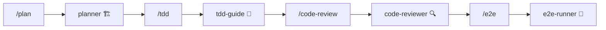

# 🤖 Agents 智能体

**Agents（智能体）** 是 ECC 的核心组件，每个智能体都是某个领域的专家，拥有特定的技能和工作流程。

> **v2.0.0 更新**：智能体数量从 13 个扩展到 **67 个**，覆盖所有主流语言和场景。

## 什么是智能体？

想象智能体就像你的 **专业团队成员**：
- 🏗️ **architect** 是你的系统架构师
- 📋 **planner** 是你的项目经理
- 🧪 **tdd-guide** 是你的测试教练
- 🔍 **code-reviewer** 是你的代码审查专家

## 67 个智能体全览

### 🎯 核心智能体

| 智能体 | 用途 | 触发命令 |
|--------|------|----------|
| **planner** | 制定实施计划 | `/plan` |
| **architect** | 系统设计决策 | `/architect` |
| **tdd-guide** | 测试驱动开发 | `/tdd` |
| **code-reviewer** | 代码审查 | `/code-review` |
| **security-reviewer** | 安全分析 | `/security` |
| **build-error-resolver** | 构建错误修复 | `/build-fix` |
| **e2e-runner** | 端到端测试 | `/e2e` |
| **refactor-cleaner** | 死代码清理 | `/refactor-clean` |
| **doc-updater** | 文档更新 | `/update-docs` |
| **performance-optimizer** | 性能优化 | `/perf` |
| **a11y-architect** | 无障碍架构 | — |
| **chief-of-staff** | 团队总协调 | — |
| **code-architect** | 代码架构 | — |
| **code-explorer** | 代码探索 | — |
| **code-simplifier** | 代码简化 | — |
| **comment-analyzer** | 注释分析 | — |
| **conversation-analyzer** | 会话分析 | — |
| **docs-lookup** | 文档查询 | — |
| **harness-optimizer** | 框架优化 | — |
| **loop-operator** | 循环操作员 | — |
| **marketing-agent** | 营销代理 | — |
| **pr-test-analyzer** | PR 测试分析 | — |
| **seo-specialist** | SEO 专家 | — |
| **silent-failure-hunter** | 静默失败猎手 | — |
| **spec-miner** | 规范挖掘 | — |
| **type-design-analyzer** | 类型设计分析 | — |
| **agent-evaluator** | 智能体评估 | — |

### 🌐 语言专属审查员

| 智能体 | 语言/框架 |
|--------|----------|
| **python-reviewer** | Python |
| **rust-reviewer** | Rust |
| **vue-reviewer** | Vue |
| **kotlin-reviewer** | Kotlin |
| **swift-reviewer** | Swift |
| **php-reviewer** | PHP |
| **csharp-reviewer** | C# |
| **fsharp-reviewer** | F# |
| **cpp-reviewer** | C++ |
| **flutter-reviewer** | Flutter |
| **fastapi-reviewer** | FastAPI |
| **mle-reviewer** | 机器学习工程 |
| **typescript-reviewer** | TypeScript |
| **react-reviewer** | React |
| **database-reviewer** | 数据库 |
| **django-reviewer** | Django |
| **go-reviewer** | Go |
| **java-reviewer** | Java |
| **healthcare-reviewer** | 医疗领域 |
| **homelab-architect** | 自建服务架构 |
| **network-architect** | 网络架构 |
| **network-config-reviewer** | 网络配置审查 |
| **network-troubleshooter** | 网络故障排查 |

### 🔧 构建错误解决器

| 智能体 | 用途 |
|--------|------|
| **cpp-build-resolver** | C++ 构建错误 |
| **dart-build-resolver** | Dart 构建错误 |
| **django-build-resolver** | Django 构建错误 |
| **go-build-resolver** | Go 构建错误 |
| **java-build-resolver** | Java 构建错误 |
| **kotlin-build-resolver** | Kotlin 构建错误 |
| **pytorch-build-resolver** | PyTorch 构建错误 |
| **react-build-resolver** | React 构建错误 |
| **rust-build-resolver** | Rust 构建错误 |
| **swift-build-resolver** | Swift 构建错误 |
| **harmonyos-app-resolver** | HarmonyOS 应用 |

### 🛠️ 开源与工具

| 智能体 | 用途 |
|--------|------|
| **opensource-forker** | 开源 Fork |
| **opensource-packager** | 开源打包 |
| **opensource-sanitizer** | 开源清理 |

### 🤖 GAN 工具集

| 智能体 | 用途 |
|--------|------|
| **gan-evaluator** | GAN 评估 |
| **gan-generator** | GAN 生成 |
| **gan-planner** | GAN 规划 |

## 核心智能体详解

### 🏗️ planner - 规划师

**职责**：在写代码之前制定详细的实施计划

**工作流程**：
1. 重述需求，确保理解正确
2. 分析风险和依赖
3. 分阶段制定计划
4. **等待用户确认**后才开始执行

```bash
# 使用示例
/plan 实现用户认证系统
```

### 🧪 tdd-guide - TDD 教练

**职责**：引导你通过测试驱动开发

**TDD 循环**：
```
🔴 RED    → 写一个失败的测试
🟢 GREEN  → 写最少的代码让测试通过
🔵 REFACTOR → 重构代码，保持测试通过
```

### 🔍 code-reviewer - 代码审查员

**职责**：审查代码质量，发现潜在问题

**审查维度**：
- 代码正确性
- 安全漏洞
- 性能问题
- 可维护性
- 最佳实践

### 🦀 rust-reviewer - Rust 审查员（v2.0.0 新增）

**专长**：Rust 特有的内存安全、所有权、生命周期检查

### 🌐 network-architect - 网络架构师（v2.0.0 新增）

**专长**：网络架构设计、Cisco IOS、容器网络

## 智能体协作

智能体可以协同工作，形成工作流：


```mermaid
graph LR
    A["/plan"] --> B["planner 🏗️"]
    B --> C["/tdd"]
    C --> D["tdd-guide 🧪"]
    D --> E["/code-review"]
    E --> F["code-reviewer 🔍"]
    F --> G["/e2e"]
    G --> H["e2e-runner 🎯"]
```

## 跨框架智能体

v2.0.0 的智能体配置现在支持跨 AI 框架：

```
.ecc/
├── agents/              # 通用智能体
├── .claude-plugin/      # Claude Code
├── .codex/              # Codex
├── .opencode/           # OpenCode
├── .cursor/             # Cursor
├── .gemini/             # Gemini
└── .qwen/               # Qwen
```

## 最佳实践

1. **复杂功能** → 先用 `planner` 制定计划
2. **新功能/Bug 修复** → 用 `tdd-guide` 进行 TDD
3. **代码完成后** → 用 `code-reviewer` 审查
4. **关键流程** → 用 `e2e-runner` 端到端测试
5. **语言特定** → 用对应的 `-reviewer` 智能体（如 `rust-reviewer`）
6. **构建问题** → 用对应的 `-build-resolver` 智能体

---

💡 **提示**：智能体的配置文件位于 `~/.claude/agents/` 目录下，你可以根据团队需求自定义！
