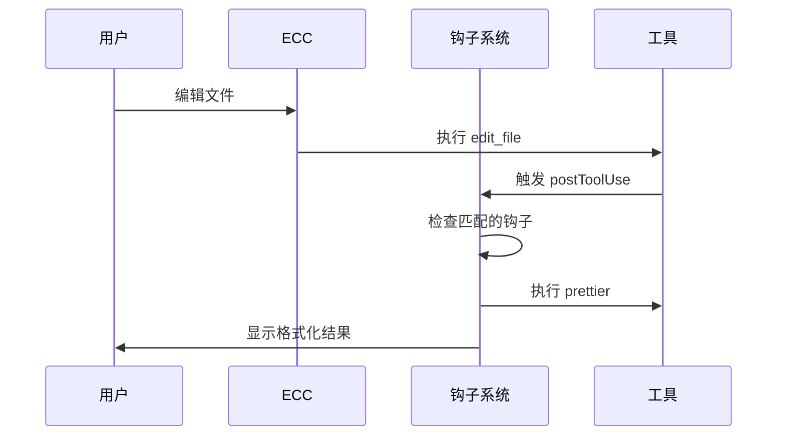

# 🪝 Hooks 钩子

**Hooks（钩子）** 是在特定事件发生时自动执行的操作，让重复性任务自动化。

## 什么是钩子？

钩子就像 **智能管家**：
- 📁 保存文件时 → 自动格式化
- 🔨 编辑 TypeScript 时 → 自动类型检查
- 🚫 检测到 `console.log` → 自动警告

## 钩子类型

### PostToolUse 钩子

**触发时机**：工具使用后自动执行

| 钩子 | 触发条件 | 动作 |
|------|----------|------|
| `prettier` | 编辑 JS/TS 文件后 | 自动格式化 |
| `tsc-check` | 编辑 `.ts/.tsx` 后 | TypeScript 类型检查 |
| `eslint` | 编辑 JS/TS 后 | ESLint 检查 |
| `console-warn` | 文件包含 `console.log` | 发出警告 |

### PreCommit 钩子

**触发时机**：Git 提交前执行

| 钩子 | 动作 |
|------|------|
| `lint-staged` | 只检查暂存文件 |
| `type-check` | 全量类型检查 |
| `test-affected` | 运行受影响的测试 |

### Stop 钩子

**触发时机**：会话结束前执行

| 钩子 | 动作 |
|------|------|
| `console-audit` | 检查所有修改文件的 `console.log` |
| `coverage-check` | 检查测试覆盖率 |
| `security-scan` | 快速安全扫描 |

## 配置钩子

在 `~/.claude/settings.json` 中配置：

```json
{
  "hooks": {
    "postToolUse": [
      {
        "name": "prettier",
        "trigger": "*.{js,ts,tsx,jsx}",
        "command": "npx prettier --write"
      },
      {
        "name": "console-warn",
        "trigger": "*.{js,ts}",
        "pattern": "console.log",
        "action": "warn"
      }
    ],
    "stop": [
      {
        "name": "console-audit",
        "command": "grep -r 'console.log' --include='*.ts'"
      }
    ]
  }
}
```

## 实际应用场景

### 场景 1：自动格式化

```json
{
  "name": "auto-format",
  "trigger": "edit_file",
  "filePattern": "*.{ts,tsx}",
  "command": "npx prettier --write ${file}"
}
```

### 场景 2：TypeScript 类型检查

```json
{
  "name": "tsc-check",
  "trigger": "edit_file",
  "filePattern": "*.{ts,tsx}",
  "command": "npx tsc --noEmit"
}
```

### 场景 3：禁止 console.log

```json
{
  "name": "no-console",
  "trigger": "edit_file",
  "filePattern": "*.{ts,tsx}",
  "pattern": "console.log",
  "severity": "error",
  "message": "生产代码不允许 console.log！"
}
```

## 钩子执行流程



## 最佳实践

1. **保持钩子轻量** - 避免耗时操作
2. **明确触发条件** - 避免不必要的执行
3. **友好的错误信息** - 帮助用户理解问题
4. **可配置开关** - 允许临时禁用

---

💡 **提示**：钩子是提升开发效率的利器，但过多的钩子可能拖慢工作流，请谨慎添加！
