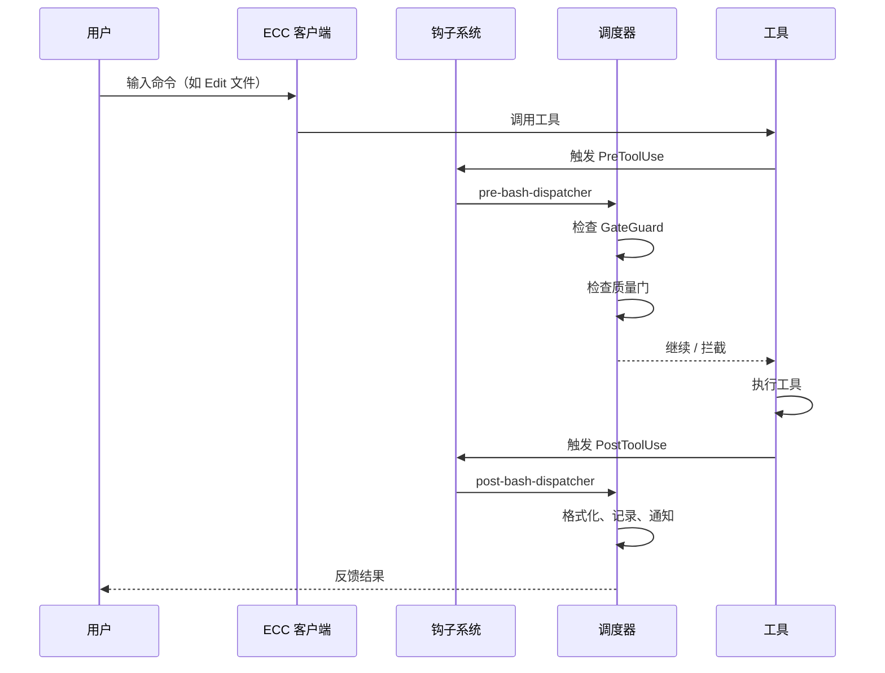

# 🪝 Hooks 钩子

**Hooks（钩子）** 是在特定事件发生时自动执行的操作，让重复性任务自动化、可观测化。ECC v2.0.0 引入了**统一调度器架构**（consolidated dispatcher），所有 hook 通过 `hooks/hooks.json` 注册，由 `pre-bash-dispatcher.js` 和 `post-bash-dispatcher.js` 统一调度。

## 什么是钩子？

钩子就像 **智能管家**：
- 📁 保存文件时 → 自动格式化
- 🔨 编辑 TypeScript 时 → 自动类型检查
- 🚫 检测到 `console.log` → 自动警告
- 🛡️ 危险命令 → 自动拦截（GateGuard）
- 📊 会话开始 → 加载上下文、检测项目状态

## 7 类事件

| 事件 | 触发时机 | 用途 |
|------|----------|------|
| **SessionStart** | 会话开始 | 加载上下文、检测项目状态、注入历史 |
| **PreToolUse** | 工具调用前 | 拦截危险操作、提醒检查、注入观察信号 |
| **PostToolUse** | 工具调用后 | 格式化、类型检查、记录结果 |
| **PostToolUseFailure** | 工具调用失败 | 记录失败、分析静默失败 |
| **PreCompact** | 上下文压缩前 | 持久化会话状态 |
| **Stop** | 每次响应结束 | 格式检查、覆盖率检查、console.log 审计 |
| **SessionEnd** | 会话结束 | 归档、清理、释放资源 |

## 47 个钩子脚本

### 🛡️ Pre-tool 拦截类

| 脚本 ID | 触发条件 | 用途 |
|---------|----------|------|
| `pre:bash:dispatcher` | Bash | 统一调度：质量、tmux、push、GateGuard |
| `pre:write:doc-file-warning` | Write | 警告非标准文档文件 |
| `pre:edit-write:suggest-compact` | Edit/Write | 提示手动压缩上下文 |
| `pre:observe:continuous-learning` | 任意 | 捕获工具调用用于持续学习 |
| `pre-bash-dev-server-block` | Bash | 阻止后台 dev 服务器 |
| `pre-bash-tmux-reminder` | Bash | 提醒使用 tmux |
| `pre-bash-git-push-reminder` | Bash | push 之前提醒 |
| `pre-bash-commit-quality` | Bash | commit 前质量检查 |
| `pre-write-doc-warn` | Write | 文档写入警告 |
| `block-no-verify` | Bash | 拦截 `--no-verify` |
| `config-protection` | Edit/Write | 阻止修改 hooks.json |
| `gateguard-fact-force` | Bash | GateGuard 强制检查 |
| `quality-gate` | Bash | 质量门检查 |

### 🔧 Post-tool 处理类

| 脚本 ID | 触发条件 | 用途 |
|---------|----------|------|
| `post:bash:dispatcher` | Bash | 统一调度：构建完成、PR 创建、命令日志 |
| `post:edit:format` | Edit | Prettier 自动格式化 |
| `post:edit:typecheck` | Edit | TypeScript 类型检查 |
| `post:edit:console-warn` | Edit | 检测 console.log |
| `post:edit:accumulator` | Edit | 编辑累积器 |
| `post-bash-build-complete` | Bash | 构建完成通知 |
| `post-bash-pr-created` | Bash | PR 创建后处理 |
| `post-bash-command-log` | Bash | 命令日志 |
| `check-console-log` | Stop | 审计 console.log |
| `stop-format-typecheck` | Stop | 格式与类型检查 |
| `evaluate-session` | Stop | 会话评估 |

### 📊 会话生命周期

| 脚本 ID | 触发条件 | 用途 |
|---------|----------|------|
| `session:start` | SessionStart | 加载上下文 |
| `session-start-bootstrap` | SessionStart | 项目状态检测 |
| `session-start` | SessionStart | 会话启动 |
| `session-activity-tracker` | 周期 | 活动追踪 |
| `session-end-marker` | SessionEnd | 结束标记 |
| `session-end` | SessionEnd | 会话结束处理 |
| `pre:compact` | PreCompact | 压缩前持久化 |

### 📈 可观测与监控

| 脚本 ID | 用途 |
|---------|------|
| `observe-runner` | 连续学习观察器（pre + post 两个 hook ID） |
| `ecc-context-monitor` | 上下文窗口监控 |
| `ecc-metrics-bridge` | 指标桥接 |
| `ecc-statusline` | 状态栏 |
| `desktop-notify` | 桌面通知 |
| `cost-tracker` | 成本追踪 |
| `governance-capture` | 治理捕获 |
| `mcp-health-check` | MCP 健康检查 |

### 🔒 安全与合规

| 脚本 ID | 用途 |
|---------|------|
| `insaits-security-monitor.py` | 实时安全监控 |
| `insaits-security-wrapper.js` | 安全包装器 |
| `cursor-session-env` | Cursor 会话环境隔离 |

### 🎨 设计与质量

| 脚本 ID | 用途 |
|---------|------|
| `design-quality-check` | 设计质量检查 |
| `auto-tmux-dev.js` | 自动 tmux dev 环境 |

## Hook 配置：hooks/hooks.json

所有 hook 在 `hooks/hooks.json` 中注册：

```json
{
  "hooks": {
    "PreToolUse": [
      {
        "matcher": "Bash",
        "hooks": [
          { "type": "command", "command": "...", "id": "pre:bash:dispatcher" }
        ]
      },
      {
        "matcher": "Write",
        "hooks": [
          { "type": "command", "command": "...", "id": "pre:write:doc-file-warning" }
        ]
      }
    ],
    "PostToolUse": [...],
    "SessionStart": [...],
    "PreCompact": [...],
    "Stop": [...],
    "SessionEnd": [...]
  }
}
```

## 调度器架构（v2.0.0 新增）

ECC v2.0.0 引入**统一调度器**（consolidated dispatcher）模式：
- `pre-bash-dispatcher.js` 是所有 Bash 调用的入口
- 根据命令类型分发到对应的专项 hook（quality / tmux / push / GateGuard）
- 减少 hook 数量但保持功能完整性
- 显著降低延迟（从 7-8 个 hook 串行执行 → 1 个调度器分发）

旧版的多个独立 hook（如 `pre-bash-quality.js` + `pre-bash-tmux.js` + `pre-bash-push.js`）已合并到调度器内。

## 干跑模式（dry-run，v2.0.0）

任何 hook 都可通过 `--dry-run` 标志预览其行为而不真正执行：

```bash
# 查看 hook 决策但不应用
git commit --dry-run
node scripts/hooks/pre-bash-dispatcher.js --dry-run
```

干跑模式输出 hook 将要执行的命令、拦截原因和建议动作。

## 钩子执行流程


```mermaid
sequenceDiagram
    participant U as 用户
    participant E as ECC 客户端
    participant H as 钩子系统
    participant S as 调度器
    participant T as 工具

    U->>E: 输入命令（如 Edit 文件）
    E->>T: 调用工具
    T->>H: 触发 PreToolUse
    H->>S: pre-bash-dispatcher
    S->>S: 检查 GateGuard
    S->>S: 检查质量门
    S-->>T: 继续 / 拦截
    T->>T: 执行工具
    T->>H: 触发 PostToolUse
    H->>S: post-bash-dispatcher
    S->>S: 格式化、记录、通知
    S-->>U: 反馈结果
```

## 自定义 Hook

在 `~/.claude/settings.json` 中添加：

```json
{
  "hooks": {
    "PostToolUse": [
      {
        "matcher": "Edit",
        "hooks": [
          {
            "type": "command",
            "command": "npx prettier --write $CLAUDE_TOOL_FILE_PATH"
          }
        ]
      }
    ]
  }
}
```

可用的占位符：
- `$CLAUDE_TOOL_FILE_PATH` — 被修改的文件路径
- `$CLAUDE_TOOL_INPUT` — 工具输入
- `$CLAUDE_PROJECT_DIR` — 项目根目录

## 最佳实践

1. **保持钩子轻量** - 避免耗时操作阻塞工具调用
2. **明确触发条件** - 用 matcher 限定精确范围
3. **友好错误信息** - 拦截时说明原因和建议
4. **可配置开关** - 允许临时禁用（用 `/hookify` 命令）
5. **使用调度器模式** - 不要为每个场景写独立 hook

## 调试与排查

```bash
# 列出所有已注册 hook
/hookify-list

# 查看 hook 帮助
/hookify-help

# 临时禁用某个 hook
/hookify-configure disable pre:bash:dispatcher

# 启用干跑模式查看决策
git commit --dry-run
```

---

💡 **提示**：钩子是提升开发效率的利器，但过多的钩子可能拖慢工作流。ECC 用调度器架构解决了这个权衡 — 7 类事件，47 个脚本，单入口调度。
