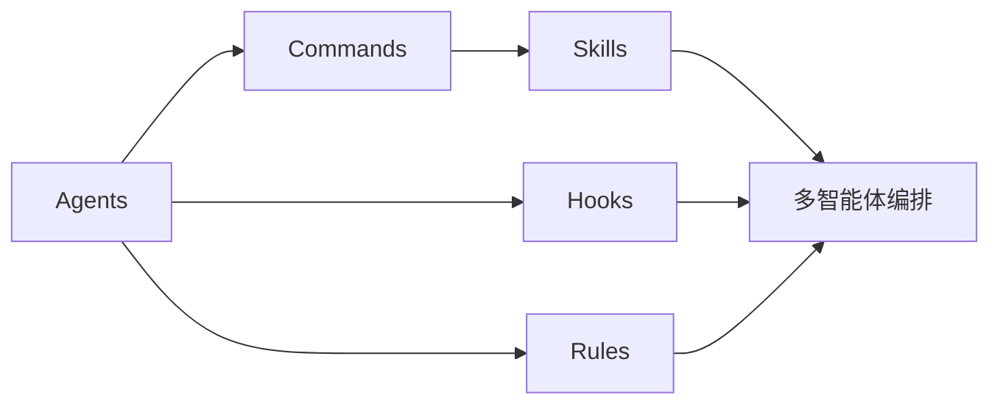

# 🧠 核心概念

ECC 的五大核心组件，每个都是独立但相互协作的：

| 组件 | 数量 | 作用 |
|------|------|------|
| 🤖 [Agents 智能体](agents) | **67** | 专家角色（架构师、审查员、TDD 教练等） |
| ⚡ [Commands 命令](commands) | **92** | 斜杠快捷指令（`/plan`、`/orch-*`、`/tdd` 等） |
| 📚 [Skills 技能](skills) | **271** | 主题知识库（编码、研究、安全、媒体、企业） |
| 🎣 [Hooks 钩子](hooks) | **47 个脚本 / 7 事件** | 自动化触发（格式化、拦截、监控） |
| 📏 [Rules 规则](rules) | **21 个语言包** | 强制编码规范与安全基线 |

## 推荐学习顺序

### 1️⃣ Agents — 团队成员

智能体是**领域专家**，每个有特定技能和工作流。67 个智能体覆盖所有主流语言、审查角色、构建修复、网络/医疗等专业领域。

👉 [深入 Agents](agents)

### 2️⃣ Commands — 快捷指令

斜杠命令是触发 ECC 功能的入口。v2.0.0 引入了 `orch-*` 编排器家族，把"7 步手动串联"压缩为"1 个意图描述"。

👉 [深入 Commands](commands)

### 3️⃣ Skills — 知识手册

技能是**主题化的最佳实践**，包含完整的执行流程、检查清单、参考资料。271 个技能按编程、研究、安全、Agent、媒体、企业等 17 大类组织。

👉 [深入 Skills](skills)

### 4️⃣ Hooks — 自动化管家

钩子在特定事件发生时自动执行：编辑文件后自动格式化、检测 `console.log`、会话开始时加载上下文。v2.0.0 引入**统一调度器**架构。

👉 [深入 Hooks](hooks)

### 5️⃣ Rules — 行为准则

21 个语言规则包覆盖主流语言 + 框架。规则是 AI 必须始终遵守的准则。

👉 [深入 Rules](rules)

## v2.0.0 新变化速览

- **`orch-*` 编排器家族**：6 个新命令（orch-build-mvp / orch-add-feature / orch-fix-defect / orch-refine-code / orch-change-feature / orch-pipeline）
- **`epic-*` 大型项目工作流**：7 个 epic 管理命令
- **Hermes Operator**：跨 8 个 AI 框架的统一控制层
- **MCP 审计**：默认连接器从 6 个缩减为 1 个（chrome-devtools）
- **性能优化技能族**：parallel-execution-optimizer、benchmark-optimization-loop、data-throughput-accelerator、latency-critical-systems 等

👉 [v2.0.0 完整更新日志](../releases/v2.0.0)
