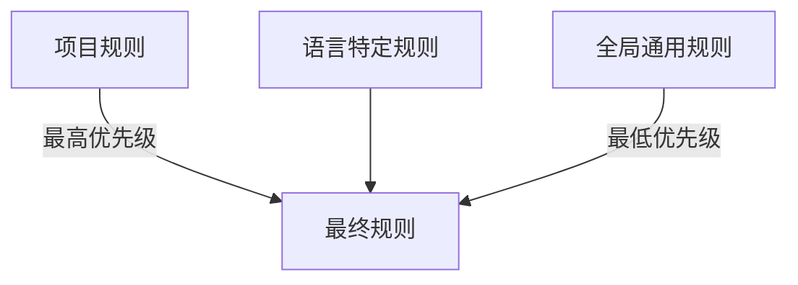

# 📏 Rules 规则

**Rules（规则）** 是 AI 必须始终遵守的准则，确保代码质量和团队一致性。

## 什么是规则？

规则就像 **团队约定**：
- 🎨 代码风格（缩进、命名、格式）
- 🔒 安全规范（密钥管理、输入验证）
- 🏗️ 架构约定（目录结构、分层设计）
- 🧪 测试要求（覆盖率、测试策略）

## 规则层级

### 1. 全局规则

适用于所有项目，配置在 `~/.claude/rules/`：

```
~/.claude/rules/
├── common/
│   ├── coding-style.md
│   ├── security.md
│   └── testing.md
└── typescript/
    ├── coding-style.md
    └── patterns.md
```

### 2. 项目规则

适用于特定项目，配置在项目根目录的 `.codebuddy/rules/`：

```
your-project/
└── .codebuddy/rules/
    ├── project-conventions.md
    └── api-design.md
```

## 核心规则示例

### 编码风格规则

```markdown
# TypeScript Coding Style

## 命名规范
- 变量/函数：camelCase
- 类/接口：PascalCase
- 常量：UPPER_SNAKE_CASE
- 文件名：kebab-case.ts

## 禁止事项
- ❌ 使用 any 类型
- ❌ 生产代码中的 console.log
- ❌ 硬编码的密钥或密码
```

### 安全规则

```markdown
# Security Rules

## 密钥管理
✅ CORRECT:
const apiKey = process.env.API_KEY

❌ WRONG:
const apiKey = "sk-xxxxx"

## 输入验证
- 所有用户输入必须验证
- 使用 Zod 进行 schema 验证
```

### 测试规则

```markdown
# Testing Rules

## 覆盖率要求
- 核心业务逻辑: >= 80%
- 工具函数: >= 90%
- UI 组件: >= 70%

## 测试命名
describe('ComponentName', () => {
  it('should [expected behavior] when [condition]', () => {})
})
```

## 规则文件格式

规则文件使用 Markdown 格式，包含以下结构：

```yaml
---
name: my-rule
priority: high
scope: typescript
---
```

**文件内容结构**：
- **# 规则名称** - 规则标题
- **## 背景** - 为什么需要这个规则
- **## 规则内容** - 具体规则描述
- **## 正确示例** - 展示正确的代码写法
- **## 错误示例** - 展示错误的代码写法
- **## 例外情况** - 什么时候可以例外

## 规则优先级

规则按以下优先级应用：



1. **项目规则** - 最高优先级
2. **语言特定规则** - 次优先级
3. **全局通用规则** - 基础规则

## 安装语言规则包

ECC 提供预配置的语言规则包：

```bash
# 安装 TypeScript 规则
cp -r rules/typescript/* ~/.codebuddy/rules/

# 安装 Python 规则
cp -r rules/python/* ~/.codebuddy/rules/

# 安装 Go 规则
cp -r rules/golang/* ~/.codebuddy/rules/
```

## 最佳实践

1. **规则要具体** - 避免模糊的描述
2. **提供示例** - 正确和错误的代码示例
3. **说明原因** - 解释为什么需要这个规则
4. **允许例外** - 明确什么情况下可以例外
5. **定期更新** - 随着项目演进更新规则

---

💡 **提示**：好的规则应该是团队共识，建议通过团队讨论后再添加新规则！
