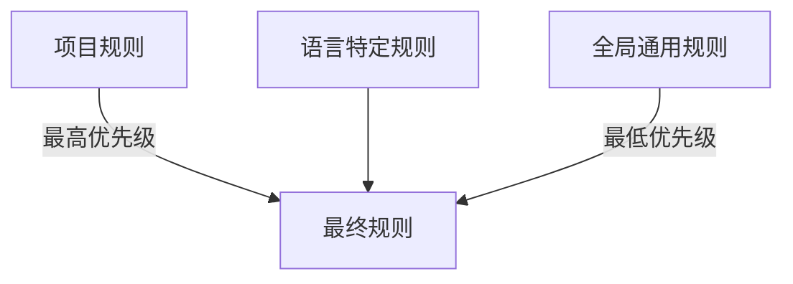

# 📏 Rules 规则

**Rules（规则）** 是 AI 必须始终遵守的准则，确保代码质量和团队一致性。

> **v2.0.0 更新**：规则包从 8 个扩展到 **22 个**，新增了 Rust/Vue/React/Ruby/Swift/PHP/Perl/Kotlin/Dart/F#/ArkTS/C++ 等多个语言生态。

## 什么是规则？

规则就像 **团队约定**：
- 🎨 代码风格（缩进、命名、格式）
- 🔒 安全规范（密钥管理、输入验证）
- 🏗️ 架构约定（目录结构、分层设计）
- 🧪 测试要求（覆盖率、测试策略）

## 22 个规则包

### 🌍 通用规则（必装）

| 规则包 | 说明 |
|--------|------|
| `common` | 通用规则：编码风格、安全、测试、性能 |

### 🧑‍💻 主流语言

| 规则包 | 说明 |
|--------|------|
| `typescript` | TypeScript/JavaScript |
| `python` | Python |
| `golang` | Go |
| `java` | Java |
| `cpp` | C++（v2.0.0 新增） |
| `csharp` | C#（v2.0.0 新增） |
| `fsharp` | F#（v2.0.0 新增） |
| `rust` | Rust（v2.0.0 新增） |
| `ruby` | Ruby（v2.0.0 新增） |
| `swift` | Swift（v2.0.0 新增） |
| `kotlin` | Kotlin（v2.0.0 新增） |
| `dart` | Dart（v2.0.0 新增） |
| `php` | PHP（v2.0.0 新增） |
| `perl` | Perl（v2.0.0 新增） |
| `arkts` | ArkTS（v2.0.0 新增） |

### 🎨 前端框架

| 规则包 | 说明 |
|--------|------|
| `react` | React（v2.0.0 新增） |
| `vue` | Vue（v2.0.0 新增） |
| `nuxt` | Nuxt（v2.0.0 新增） |
| `angular` | Angular（v2.0.0 新增） |
| `web` | Web 通用（v2.0.0 新增） |

## 规则层级

### 1. 全局规则

适用于所有项目，配置在 `~/.claude/rules/`：

```
~/.claude/rules/
├── common/                  # 通用
│   ├── coding-style.md
│   ├── security.md
│   └── testing.md
├── typescript/              # 语言
├── python/
├── golang/
├── rust/                    # v2.0.0 新增
├── vue/                     # v2.0.0 新增
└── react/                   # v2.0.0 新增
```

### 2. 项目规则

适用于特定项目，配置在项目根目录的 `.claude/rules/`：

```
your-project/
└── .claude/rules/
    ├── project-conventions.md
    └── api-design.md
```

## 核心规则示例

### 编码风格规则

```markdown
# TypeScript Coding Style

## 命名规范
- 变量/函数：camelCase
- 类/接口：PascalCase
- 常量：UPPER_SNAKE_CASE
- 文件名：kebab-case.ts

## 禁止事项
- ❌ 使用 any 类型
- ❌ 生产代码中的 console.log
- ❌ 硬编码的密钥或密码
```

### 安全规则

```markdown
# Security Rules

## 密钥管理
✅ CORRECT:
const apiKey = process.env.API_KEY

❌ WRONG:
const apiKey = "sk-xxxxx"

## 输入验证
- 所有用户输入必须验证
- 使用 Zod 进行 schema 验证
```

### 测试规则

```markdown
# Testing Rules

## 覆盖率要求
- 核心业务逻辑: >= 80%
- 工具函数: >= 90%
- UI 组件: >= 70%

## 测试命名
describe('ComponentName', () => {
  it('should [expected behavior] when [condition]', () => {})
})
```

## 规则文件格式

规则文件使用 Markdown 格式，包含以下结构：

```yaml
---
name: my-rule
priority: high
scope: typescript
---
```

**文件内容结构**：
- **# 规则名称** - 规则标题
- **## 背景** - 为什么需要这个规则
- **## 规则内容** - 具体规则描述
- **## 正确示例** - 展示正确的代码写法
- **## 错误示例** - 展示错误的代码写法
- **## 例外情况** - 什么时候可以例外

## 规则优先级

规则按以下优先级应用：


```mermaid
graph TD
    A[项目规则] -->|最高优先级| D[最终规则]
    B[语言特定规则] --> D
    C[全局通用规则] -->|最低优先级| D
```

1. **项目规则** - 最高优先级
2. **语言特定规则** - 次优先级
3. **全局通用规则** - 基础规则

## 安装语言规则包

ECC 提供 22 个预配置的语言规则包：

```bash
# 通用规则（必须）
cp -r rules/common/* ~/.claude/rules/

# 选择你的语言（v2.0.0 选项）
cp -r rules/typescript/* ~/.claude/rules/
cp -r rules/python/* ~/.claude/rules/
cp -r rules/golang/* ~/.claude/rules/
cp -r rules/rust/* ~/.claude/rules/        # v2.0.0
cp -r rules/vue/* ~/.claude/rules/         # v2.0.0
cp -r rules/react/* ~/.claude/rules/       # v2.0.0
cp -r rules/swift/* ~/.claude/rules/       # v2.0.0
cp -r rules/ruby/* ~/.claude/rules/        # v2.0.0
```

## v2.0.0 新增语言规则亮点

### Rust 规则
- 内存安全与所有权检查
- 错误处理惯用法
- 异步模式

### Vue 规则
- Composition API 优先
- 响应式系统最佳实践
- 组件命名规范

### React 规则
- Hooks 使用规范
- 性能优化（memo, useMemo, useCallback）
- Context API vs 状态管理

### Swift 规则
- Swift 6 并发规则
- Actor 模型
- 协议导向设计

## 跨框架规则分发（v2.0.0 新增）

ECC v2.0.0 的规则现在支持跨 AI 框架：

```
rules/
├── common/            # 通用
├── typescript/        # TS
├── ...
└── (通过 .claude-plugin/、.codex/、.opencode/ 等分发)
```

不同框架通过相应的插件机制加载同一套规则。

## 最佳实践

1. **规则要具体** - 避免模糊的描述
2. **提供示例** - 正确和错误的代码示例
3. **说明原因** - 解释为什么需要这个规则
4. **允许例外** - 明确什么情况下可以例外
5. **定期更新** - 随着项目演进更新规则
6. **按需加载** - 只安装你项目用的语言规则包

---

💡 **提示**：好的规则应该是团队共识，建议通过团队讨论后再添加新规则！