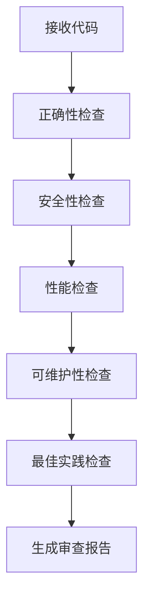

# 🎯 Skills 技能

**Skills（技能）** 是特定领域的最佳实践工作流，封装了专家级的知识和流程。

## 什么是技能？

技能就像 **专家配方**：
- 📝 **代码审查技能** - 知道从哪些角度审查代码
- 🧪 **TDD 技能** - 掌握红绿重构的节奏
- 🔒 **安全审计技能** - 了解常见漏洞和防护措施

## 技能分类

### 🔍 代码分析技能

| 技能 | 说明 |
|------|------|
| `code-review` | 多维度代码审查 |
| `security-audit` | 安全漏洞扫描 |
| `performance-analysis` | 性能瓶颈分析 |
| `complexity-check` | 代码复杂度检查 |

### 🧪 测试技能

| 技能 | 说明 |
|------|------|
| `unit-test-design` | 单元测试设计 |
| `integration-test` | 集成测试策略 |
| `e2e-test-flow` | 端到端测试流程 |
| `coverage-analysis` | 覆盖率分析 |

### 🏗️ 架构技能

| 技能 | 说明 |
|------|------|
| `system-design` | 系统架构设计 |
| `api-design` | API 接口设计 |
| `database-design` | 数据库设计 |
| `microservices` | 微服务拆分 |

### 📝 文档技能

| 技能 | 说明 |
|------|------|
| `api-documentation` | API 文档生成 |
| `code-comments` | 代码注释规范 |
| `readme-generation` | README 生成 |
| `changelog` | 变更日志 |

## 技能工作流程

以 **代码审查技能** 为例：



## 技能与智能体的关系

- **智能体** = 专家角色（如"代码审查员"）
- **技能** = 专家掌握的具体能力（如"安全审计"）

一个智能体可以拥有多个技能：

```
code-reviewer 智能体
├── code-review 技能
├── security-audit 技能
├── performance-analysis 技能
└── best-practices 技能
```

## 自定义技能

在 `~/.claude/skills/` 目录下创建：

```markdown
---
name: my-custom-skill
description: 我的自定义技能
---

# My Custom Skill

## 工作流程
1. 步骤一
2. 步骤二
3. 步骤三

## 检查清单
- [ ] 检查项 1
- [ ] 检查项 2
```

---

💡 **提示**：技能是可组合的，复杂的工作流可以由多个基础技能组成！
