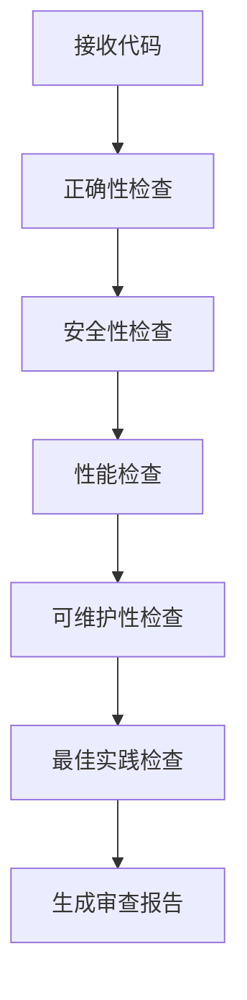

# 🎯 Skills 技能

**Skills（技能）** 是特定领域的最佳实践工作流，封装了专家级的知识和流程。

> **v2.0.0 更新**：技能数量从 28 个扩展到 **271 个**，覆盖编码、研究、安全、企业运维、AI 优化、媒体等 11 大领域。

## 什么是技能？

技能就像 **专家配方**：
- 📝 **代码审查技能** - 知道从哪些角度审查代码
- 🧪 **TDD 技能** - 掌握红绿重构的节奏
- 🔒 **安全审计技能** - 了解常见漏洞和防护措施

## 271 个技能按类别速览

### 🧑‍💻 编程语言与框架

**Web/前端**
- `frontend-patterns` `frontend-a11y` `frontend-design-direction` `frontend-slides`
- `react-patterns` `react-performance` `react-testing`
- `vue-patterns` `nuxt4-patterns` `nextjs-turbopack`
- `angular-developer` `liquid-glass-design` `vite-patterns`
- `ui-demo` `ui-to-vue` `make-interfaces-feel-better`
- `accessibility` — 无障碍标准

**后端语言**
- `golang-patterns` `golang-testing`
- `python-patterns` `python-testing` `fastapi-patterns`
- `django-patterns` `django-celery` `django-security` `django-tdd` `django-verification`
- `springboot-patterns` `springboot-security` `springboot-tdd` `springboot-verification`
- `kotlin-patterns` `kotlin-coroutines-flows` `kotlin-exposed-patterns` `kotlin-ktor-patterns` `kotlin-testing`
- `java-coding-standards` `jpa-patterns`
- `rust-patterns` `rust-testing`
- `swiftui-patterns` `swift-actor-persistence` `swift-concurrency-6-2` `swift-protocol-di-testing`
- `cpp-coding-standards` `cpp-testing`
- `csharp-testing` `dotnet-patterns`
- `dart-flutter-patterns`
- `nestjs-patterns`
- `laravel-patterns` `laravel-plugin-discovery` `laravel-security` `laravel-tdd` `laravel-verification`
- `quarkus-patterns` `quarkus-security` `quarkus-tdd` `quarkus-verification`
- `perl-patterns` `perl-security` `perl-testing`
- `generating-python-installer` — Python 打包（基于 Nuitka 商业化）

**移动端**
- `android-clean-architecture`
- `compose-multiplatform-patterns`
- `ios-icon-gen`
- `flutter-dart-code-review` — Flutter/Dart 代码审查

### 🏗️ 架构与设计

- `api-design` `api-connector-builder` `mcp-server-patterns`
- `architecture-decision-records`
- `hexagonal-architecture` `android-clean-architecture`
- `design-system` `codebase-onboarding` `code-tour`
- `intent-driven-development` `ai-first-engineering`
- `agentic-engineering` `agentic-os`
- `backend-patterns` — 后端通用模式
- `product-capability` `product-lens` — 产品能力与视角

### 🧪 测试与质量

- `tdd-workflow` `verification-loop` `eval-harness`
- `e2e-testing` `windows-desktop-e2e` `browser-qa`
- `click-path-audit`
- `clickhouse-io` `database-migrations`
- `cpp-testing` `csharp-testing` `fsharp-testing` `kotlin-testing` `perl-testing` `python-testing` `react-testing` `rust-testing`
- `production-audit` `workspace-surface-audit` `automation-audit-ops`
- `plankton-code-quality`
- `codehealth-mcp` — Code Health MCP 集成
- `regex-vs-llm-structured-text` — 正则 vs LLM 文本抽取决策

### 🔒 安全与合规

- `security-review` `security-scan` `security-bounty-hunter`
- `django-security` `springboot-security` `laravel-security` `quarkus-security` `perl-security`
- `hipaa-compliance` `healthcare-phi-compliance` `healthcare-cdss-patterns` `healthcare-emr-patterns` `healthcare-eval-harness`
- `gateguard` `safety-guard` `hookify-rules`
- `defi-amm-security` `llm-trading-agent-security`
- `prediction-market-risk-review`
- `customs-trade-compliance`

### 🤖 Agent 与 AI 系统

- `agent-architecture-audit` `agent-eval` `agent-harness-construction` `agent-introspection-debugging` `agent-self-evaluation` `agent-sort`
- `agent-payment-x402`
- `autonomous-agent-harness` `autonomous-loops` `continuous-agent-loop`
- `team-agent-orchestration` `team-builder` `dynamic-workflow-mode`
- `plan-orchestrate` `dmux-workflows`
- `cost-aware-llm-pipeline` `cost-tracking` `token-budget-advisor` `context-budget`
- `prompt-optimizer` `iterative-retrieval` `recursive-decision-ledger`
- `ai-regression-testing`
- `gan-style-harness` `ml-adoption-playbook` `mle-workflow` `recsys-pipeline-architect`
- `foundation-models-on-device` `pytorch-patterns`
- `executor-mode` `council`
- `openclaw-persona-forge` — OpenClaw 角色生成

### 🚀 性能优化（v2.0.0 重磅新增）

- `parallel-execution-optimizer` — 并行执行优化
- `benchmark` `benchmark-methodology` — 标准化基准测试
- `benchmark-optimization-loop` — 基准优化循环
- `data-throughput-accelerator` — 数据吞吐加速
- `latency-critical-systems` — 低延迟系统
- `connections-optimizer`
- `content-hash-cache-pattern`
- `nextjs-turbopack`
- `react-performance`

### 🗄️ 数据与基础设施

- `clickhouse-io` `mysql-patterns` `postgres-patterns` `redis-patterns` `prisma-patterns`
- `docker-patterns` `kubernetes-patterns` `deployment-patterns` `bun-runtime` `flox-environments`
- `terminal-ops` `tinystruct-patterns` `uncloud`
- `nodejs-keccak256`
- `opensource-pipeline` — 开源发布流水线

### 📚 学习与连续性

- `continuous-learning` `continuous-learning-v2`
- `learn` `learn-eval` `evolve` `instinct-status` `instinct-export` `instinct-import`
- `rules-distill` `inherit-legacy-style` `skill-comply` `skill-scout` `skill-stocktake` `repo-scan`
- `strategic-compact`
- `santa-method`

### 🛠️ 工具与工作流

- `coding-standards` `error-handling`
- `git-workflow` `github-ops` `jira-integration` `documentation-lookup`
- `e2e-testing` `verification-loop`
- `enterprise-agent-ops` `knowledge-ops` `research-ops` `project-flow-ops`
- `config-gc` `configure-ecc` `ecc-guide` `ecc-tools-cost-audit`
- `hermes-imports`（v2.0.0 新增 — Hermes 导入工具）

### 🎬 媒体与内容

- `article-writing` `investor-materials` `investor-outreach`
- `marketing-campaign` `social-publisher` `crosspost` `x-api`
- `manim-video` `remotion-video-creation` `video-editing` `videodb`
- `blender-motion-state-inspection` `motion-foundations` `motion-patterns` `motion-advanced` `motion-ui`
- `fal-ai-media` `ios-icon-gen` `liquid-glass-design`
- `frontend-slides`
- `brand-voice` `brand-discovery` `competitive-platform-analysis` `competitive-report-structure`
- `market-research` `lead-intelligence` `social-graph-ranker` `crosspost`
- `seo`
- `visa-doc-translate` `nutrient-document-processing`
- `content-engine` — 内容引擎

### 🏢 业务与企业

- `customer-billing-ops` `email-ops` `messages-ops` `unified-notifications-ops`
- `finance-billing-ops` `cost-tracking`
- `energy-procurement` `carrier-relationship-management`
- `inventory-demand-planning` `production-scheduling` `logistics-exception-management` `returns-reverse-logistics`
- `quality-nonconformance` `ito-basket-compare` `ito-data-atlas-agent` `ito-market-intelligence` `ito-trade-planner`
- `carrier-relationship-management`
- `google-workspace-ops` — Google Workspace 运维

### 🌐 网络与运维

- `cisco-ios-patterns` `network-bgp-diagnostics` `network-config-validation` `network-interface-health` `netmiko-ssh-automation`
- `homelab-architect` `homelab-network-readiness` `homelab-network-setup` `homelab-pihole-dns` `homelab-vlan-segmentation` `homelab-wireguard-vpn`
- `carrier-relationship-management`
- `canary-watch`

### 🔬 科学与研究

- `deep-research` `research-ops` `exa-search` `search-first`
- `scientific-db-pubmed-database` `scientific-db-uspto-database` `scientific-pkg-gget` `scientific-thinking-literature-review` `scientific-thinking-scholar-evaluation`
- `prediction-market-oracle-research`

### 🎯 编排器家族（v2.0.0 新增）

- `orch-build-mvp` — MVP 构建
- `orch-add-feature` — 添加功能
- `orch-fix-defect` — 修复缺陷
- `orch-refine-code` — 代码优化
- `orch-change-feature` — 修改功能
- `orch-pipeline` — 编排管道

### 🆕 v2.0.0 全新领域

- `blueprint` `dashboard-builder` `data-scraper-agent` `tinystruct-patterns` `taste` `ui-to-vue`
- `nanoclaw-repl` `nanoclaw-persona-forge`
- `ck` `claude-devfleet`
- `evm-token-decimals` `crypto/llm-trading-agent-security`
- `ralphinho-rfc-pipeline`
- `recsys-pipeline-architect` `ml-adoption-playbook`
- `dynamic-workflow-mode` `plan-orchestrate`
- `hermes-imports` — Hermes 框架导入
- `homelab-*` — 家庭实验室全套
- `healthcare-*` — 医疗合规全套
- `laravel-*` — Laravel 框架全套
- `quarkus-*` — Quarkus 框架全套
- `springboot-*` — Spring Boot 框架全套

## 技能工作流程

以 **代码审查技能** 为例：


```mermaid
graph TD
    A[接收代码] --> B[正确性检查]
    B --> C[安全性检查]
    C --> D[性能检查]
    D --> E[可维护性检查]
    E --> F[最佳实践检查]
    F --> G[生成审查报告]
```

## 技能与智能体的关系

- **智能体** = 专家角色（如"代码审查员"）
- **技能** = 专家掌握的具体能力（如"安全审计"）

一个智能体可以拥有多个技能：

```
code-reviewer 智能体
├── code-review 技能
├── security-audit 技能
├── performance-analysis 技能
└── best-practices 技能
```

## 自定义技能

在 `~/.claude/skills/` 目录下创建：

```markdown
---
name: my-custom-skill
description: 我的自定义技能
---

# My Custom Skill

## 工作流程
1. 步骤一
2. 步骤二
3. 步骤三

## 检查清单
- [ ] 检查项 1
- [ ] 检查项 2
```

---

💡 **提示**：技能是可组合的，复杂的工作流可以由多个基础技能组成！
