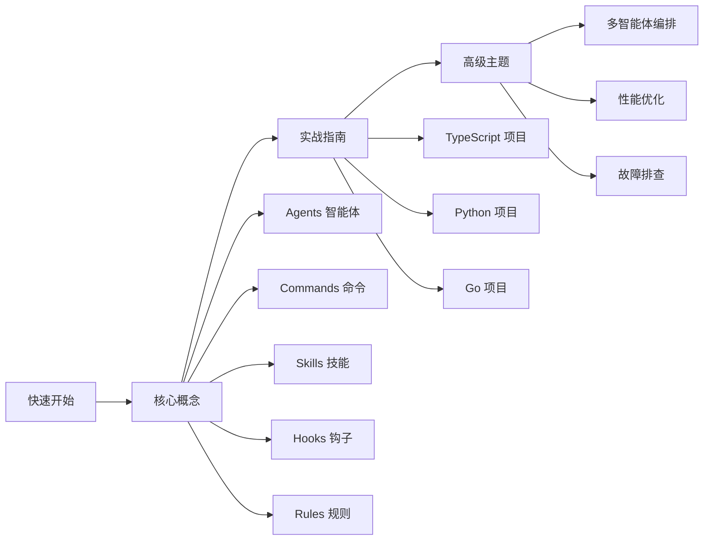

# 🚀 欢迎来到 Everything Claude Code

> **一句话概括**：让 Claude Code 变成你的超级开发伙伴！

## ✨ 这是什么？

**Everything Claude Code (ECC)** 是一套**生产级**的 Claude Code 配置集合，由 Anthropic 黑客马拉松冠军打造。

```bash
┌─────────────────────────────────────────────────────────┐
│  你现在的开发状态：                                        │
│  ❌ 手动查文档                                             │
│  ❌ 反复说同样的话                                         │
│  ❌ 代码风格不一致                                         │
├─────────────────────────────────────────────────────────┤
│  使用 ECC 后的状态：                                       │
│  ✅ 13+ 专业智能体自动协作                                  │
│  ✅ 31+ 斜杠命令一键执行                                    │
│  ✅ 28+ 技能库覆盖全栈                                     │
│  ✅ 自动化钩子智能触发                                     │
└─────────────────────────────────────────────────────────┘
```

## 🎯 核心能力

| 组件 | 数量 | 作用 |
|------|------|------|
| 🤖 **Agents** | 13+ | 架构师、代码审查员、安全专家、TDD教练... |
| ⚡ **Commands** | 31+ | `/plan`, `/tdd`, `/code-review`, `/build-fix`... |
| 📚 **Skills** | 28+ | 前端、后端、Python、Go、安全等全栈技能 |
| 🎣 **Hooks** | 20+ | 智能触发代码检查、格式化等自动化操作 |
| 📏 **Rules** | 全覆盖 | TypeScript/Python/Go 编码规范 |

## 🚀 5分钟快速开始

### 1️⃣ 安装插件

```bash
# 添加市场
codebuddy plugin marketplace add https://github.com/affaan-m/everything-claude-code

# 安装插件
codebuddy plugin install everything-claude-code@everything-claude-code
```

### 2️⃣ 安装规则

```bash
# 复制通用规则
cp -r rules/common/* .codebuddy/rules/

# 如果需要 TypeScript 规则
cp -r rules/typescript/* .codebuddy/rules/
```

### 3️⃣ 开干！

```bash
# 试试这些超能力命令
/plan "Add user authentication"
/tdd
/code-review
/build-fix
```

## 📚 学习路径



## 💡 核心概念速览

### 🤖 Agents - 智能体团队

就像餐厅有不同岗位，每个智能体有自己的专长：

| 智能体 | 职责 | 使用场景 |
|--------|------|----------|
| **planner** | 功能规划师 | 制定实现计划、任务分解 |
| **architect** | 系统架构师 | 技术选型、架构决策 |
| **code-reviewer** | 代码审查员 | 质量、安全、可维护性检查 |
| **security-reviewer** | 安全专家 | 漏洞分析、安全审计 |
| **tdd-guide** | TDD教练 | 红绿重构循环指导 |
| **e2e-runner** | E2E测试员 | Playwright测试生成与执行 |

### ⚡ Commands - 斜杠命令

像操作超级英雄技能一样，输入 `/` 就能召唤各种能力：

```bash
/plan "I need to add real-time notifications"  # 制定实现计划
/tdd                                           # 启动TDD工作流  
/code-review                                   # 代码审查
/build-fix                                     # 自动修复构建错误
/e2e --url=http://localhost:3000              # E2E测试
```

### 📚 Skills - 主题技能库

技能是工作流定义，包含特定领域的最佳实践：

- **frontend-patterns** - React/Next.js 模式与最佳实践
- **backend-patterns** - API、数据库、缓存设计模式
- **python-patterns** - Python 惯用法与最佳实践
- **django-patterns** - Django 框架模式
- **continuous-learning** - 自动从会话提取模式
- **tdd-workflow** - 完整TDD方法论

### 🎣 Hooks - 自动化钩子

Hooks 能在特定事件发生时自动执行操作：

- **SessionStart** - 会话开始时加载上下文
- **PreToolUse** - 工具使用前拦截检查
- **PostToolUse** - 工具使用后格式化代码
- **Stop** - 每次响应后检查 console.log

### 📏 Rules - 行为准则

Rules 是AI在**所有任务**中都必须遵守的指导原则：

- 编码风格、不可变性、文件组织
- 提交格式、PR流程
- TDD、80%覆盖率要求
- 模型选择、上下文管理
- 设计模式、安全检查

## 🎓 比喻理解

| 概念 | 类比 | 说明 |
|------|------|------|
| **Agents** | 专家团队 | 餐厅的不同岗位，各司其职 |
| **Commands** | 快捷按钮 | 手机的一键指令 |
| **Skills** | 工作手册 | 特定领域的"武功秘籍" |
| **Hooks** | 自动化助手 | 智能家居的自动触发 |
| **Rules** | 行为准则 | 公司的员工手册 |
| **Contexts** | 工作模式 | 演员换戏服切换场景 |

## 🔥 实战入门

### 示例1：/plan 制定计划

```bash
/plan "Implement a shopping cart with Stripe payment"
```

输出：
- ✓ 分析需求
- ✓ 制定实施计划
- ✓ 推荐相关技能
- ✓ 分解任务步骤
- ✓ 等待你确认后执行

### 示例2：TDD 红绿重构

```bash
/tdd --feature="user registration"
```

跟随AI引导完成：
1. 🔴 RED - 写失败的测试
2. 🟢 GREEN - 写最简实现让测试通过
3. 🔵 REFACTOR - 重构代码
4. ✅ VERIFY - 确保80%+覆盖率

### 示例3：智能代码审查

```bash
# 提交前自动审查
/code-review

# 特定文件审查
/code-review --files="src/auth/*.ts"
```

## 🌟 下一步

选择你想深入学习的主题：

- 📖 [快速开始指南](quick-start/) - 完整安装与配置教程
- 🧠 [核心概念](core-concepts/) - 深入理解 Agents/Commands/Skills/Hooks/Rules
- 🛠️ [实战指南](guides/) - TypeScript/Python/Go 项目实战
- 🚀 [高级主题](advanced/) - 多智能体编排、性能优化、故障排查

---

**🎉 准备好你的 ECC 超能力之旅了吗？让我们开始吧！**
