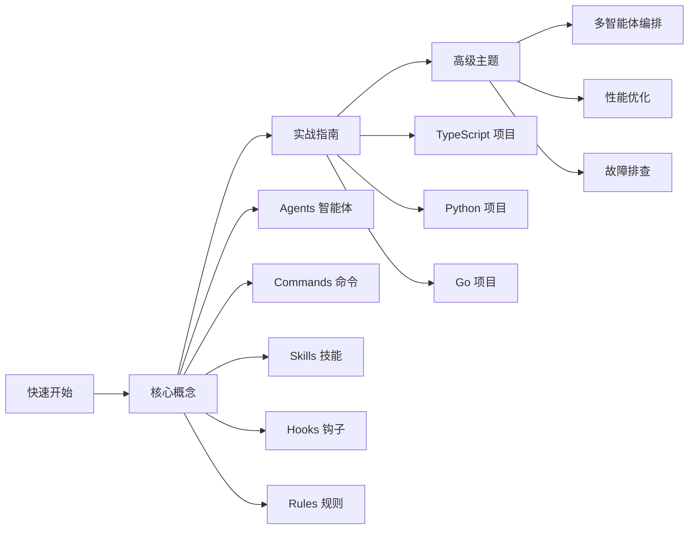

# 🚀 欢迎来到 Everything Claude Code

> **一句话概括**：让 Claude Code 变成你的超级开发伙伴！

## ✨ 这是什么？

**Everything Claude Code (ECC)** 是一套**生产级**的 Claude Code 配置集合，由 Anthropic 黑客马拉松冠军打造。**v2.0.0** 已升级为跨 AI Agent 框架的**操作控制系统**（Hermes Operator）。

```bash
┌─────────────────────────────────────────────────────────┐
│  ECC v2.0.0  —  Harness-Native Agent OS                 │
├─────────────────────────────────────────────────────────┤
│  🤖 67 个专业智能体                                      │
│  ⚡ 92 个斜杠命令                                       │
│  📚 271 个技能库覆盖全栈                                 │
│  🎣 20+ 自动化钩子                                       │
│  📏 22 个语言规则包                                      │
│  🌐 跨 7+ AI 框架支持                                    │
└─────────────────────────────────────────────────────────┘
```

## 🌐 跨框架支持（v2.0.0 新特性）

ECC 不再只是 Claude Code 的配置 — 它现在是一套**跨 AI Agent 框架**的操作控制平面：

| 框架 | 支持度 | 配置文件目录 |
|------|--------|------------|
| **Claude Code** | ⭐ 一等公民 | `.claude-plugin/` |
| **Codex** | ✅ 完整 | `.codex/`, `.codex-plugin/` |
| **OpenCode** | ✅ 完整 | `.opencode/` |
| **Cursor** | ✅ 完整 | `.cursor/` |
| **Gemini** | ✅ 完整 | `.gemini/` |
| **Zed** | ✅ 完整 | 配置在 settings.json |
| **GitHub Copilot** | ✅ 完整 | `.github/copilot-instructions.md` |
| **Terminal / Dmux** | ✅ 完整 | — |

## 🎯 核心能力

| 组件 | 数量（v2.0.0） | 作用 |
|------|--------|------|
| 🤖 **Agents** | 67 | 架构师、代码审查员、安全专家、TDD教练、语言专属审查员 |
| ⚡ **Commands** | 92 | `/plan`, `/tdd`, `/code-review`, `/build-fix`, `/orch-*` 等 |
| 📚 **Skills** | 271 | 编码、研究、安全、媒体、企业运维、Agent 工作流 |
| 🎣 **Hooks** | 20+ | 智能触发代码检查、格式化等自动化操作 |
| 📏 **Rules** | 22 个语言包 | TypeScript/Python/Go/Rust/Ruby/Swift/Vue/React 等 |

## 🚀 5分钟快速开始

### 1️⃣ 安装插件

```bash
# 添加市场
/plugin marketplace add https://github.com/affaan-m/ECC

# 安装插件
/plugin install ecc
```

> **升级到 v2.0.0**：现有用户执行 `/plugin update ecc`

### 2️⃣ 安装规则

```bash
# 复制通用规则（必须）
cp -r rules/common/* ~/.claude/rules/

# 选择你的语言/框架（v2.0.0 增加了更多）
cp -r rules/typescript/* ~/.claude/rules/    # TypeScript
cp -r rules/python/* ~/.claude/rules/        # Python
cp -r rules/golang/* ~/.claude/rules/         # Go
cp -r rules/rust/* ~/.claude/rules/           # Rust
cp -r rules/vue/* ~/.claude/rules/            # Vue
cp -r rules/react/* ~/.claude/rules/          # React
cp -r rules/swift/* ~/.claude/rules/          # Swift
```

### 3️⃣ 开干！

```bash
# 试试这些超能力命令
/plan "Add user authentication"
/tdd
/code-review
/build-fix
/orch-build-mvp "MVP for todo app"    # v2.0.0 新增 orchestrator 命令
```

## 🆕 v2.0.0 重磅新功能

### 🎯 Hermes Operator

ECC v2.0.0 引入了 **Hermes 操作员**概念 — 跨 AI 框架的统一控制层：

- **`ecc.session.v1`** — 框架中立的会话适配器（Claude Code, Codex, OpenCode, dmux）
- **`ecc.mcp.v1`** — MCP 服务器清单，跨框架统一视图，支持碎片化检测
- **Worktree-lifecycle service** — 确定性冲突预测和安全 GC

### ⚡ orch-* 编排器家族

```
/orch-build-mvp        # 快速构建 MVP
/orch-add-feature      # 添加功能
/orch-fix-defect       # 修复缺陷
/orch-refine-code      # 优化代码
/orch-change-feature   # 修改现有功能
```

### 🚀 性能优化包

- `parallel-execution-optimizer` — 并行执行优化
- `benchmark-optimization-loop` — 基准优化循环
- `data-throughput-accelerator` — 数据吞吐加速
- `latency-critical-systems` — 低延迟系统
- `recursive-decision-ledger` — 递归决策账本

## 📚 学习路径


```mermaid
graph LR
    A[快速开始] --> B[核心概念]
    B --> C[实战指南]
    C --> D[高级主题]
    
    B --> B1[Agents 智能体]
    B --> B2[Commands 命令]
    B --> B3[Skills 技能]
    B --> B4[Hooks 钩子]
    B --> B5[Rules 规则]
    
    C --> C1[TypeScript 项目]
    C --> C2[Python 项目]
    C --> C3[Go 项目]
    
    D --> D1[多智能体编排]
    D --> D2[性能优化]
    D --> D3[故障排查]
```

## 💡 核心概念速览

### 🤖 Agents - 智能体团队

就像餐厅有不同岗位，每个智能体有自己的专长。v2.0.0 已扩展到 67 个，涵盖：

| 分类 | 示例 |
|------|------|
| **核心** | planner, architect, code-reviewer, security-reviewer, tdd-guide |
| **语言专属** | python-reviewer, rust-reviewer, vue-reviewer, kotlin-reviewer, swift-reviewer, php-reviewer, csharp-reviewer, fsharp-reviewer, flutter-reviewer, fastapi-reviewer, mle-reviewer, typescript-reviewer, react-reviewer, database-reviewer |
| **构建** | build-error-resolver, cpp-build-resolver, dart-build-resolver, django-build-resolver, go-build-resolver, java-build-resolver, kotlin-build-resolver, pytorch-build-resolver, react-build-resolver, rust-build-resolver, swift-build-resolver, harmonyos-app-resolver |
| **专业** | chief-of-staff, code-architect, code-explorer, code-simplifier, comment-analyzer, conversation-analyzer, doc-updater, docs-lookup, e2e-runner, harness-optimizer, healthcare-reviewer, homelab-architect, loop-operator, marketing-agent, network-architect, network-config-reviewer, network-troubleshooter, opensource-forker, opensource-packager, opensource-sanitizer, performance-optimizer, pr-test-analyzer, refactor-cleaner, seo-specialist, silent-failure-hunter, spec-miner, type-design-analyzer |

### ⚡ Commands - 斜杠命令

92 个命令，按类别：

```bash
# 规划
/plan "I need to add real-time notifications"
/plan-prd                              # PRD 模式规划
/feature-dev                           # 完整功能开发

# 开发
/tdd                                   # TDD 工作流
/build-fix                             # 修复构建错误
/pm2                                   # PM2 服务生命周期

# 审查
/code-review                           # 代码审查
/security-scan                         # 安全扫描
/review-pr                             # PR 审查

# 编排（v2.0.0）
/orch-build-mvp "mvp description"      # 快速 MVP
/orch-add-feature                      # 添加功能
/orch-fix-defect                       # 修复缺陷
/multi-execute                         # 多智能体执行
/multi-plan                            # 多智能体规划

# 技能管理
/learn /learn-eval                     # 提取模式
/instinct-status                       # 查看学习本能
/evolve                                # 聚合成技能
/skill-create                          # 从 git 历史创建技能
```

### 📚 Skills - 主题技能库

271 个技能按 11 大类组织：

- **编程** — frontend-patterns, backend-patterns, golang-patterns, python-patterns, django-patterns, springboot-patterns
- **研究** — deep-research, article-writing, brand-discovery
- **安全** — security-review, django-security, springboot-security
- **测试** — cpp-testing, tdd-workflow, e2e-testing
- **Agent 工作流** — autonomous-agent-harness, agent-architecture-audit, agent-eval
- **媒体/演示** — slidev, blender-motion-state-inspection
- **企业运维** — kubernetes-patterns, clickhouse-io, postgresql
- **AI 优化** — parallel-execution-optimizer, benchmark-optimization-loop, latency-critical-systems
- **学习系统** — continuous-learning, continuous-learning-v2, instinct-export

### 🎣 Hooks - 自动化钩子

Hooks 能在特定事件发生时自动执行操作：

- **SessionStart** - 会话开始时加载上下文
- **PreToolUse** - 工具使用前拦截检查
- **PostToolUse** - 工具使用后格式化代码
- **Stop** - 每次响应后检查 console.log
- **dry-run mode** (v2.0.0) - 干跑模式，不真正执行

### 📏 Rules - 行为准则

22 个语言规则包：

**通用**: common
**语言**: typescript, python, golang, java, kotlin, rust, swift, ruby, php, perl, csharp, dart, fsharp, cpp, arkts
**框架**: react, vue, nuxt, angular, web

## 🎓 比喻理解

| 概念 | 类比 | 说明 |
|------|------|------|
| **Agents** | 专家团队 | 餐厅的不同岗位，各司其职 |
| **Commands** | 快捷按钮 | 手机的一键指令 |
| **Skills** | 工作手册 | 特定领域的"武功秘籍" |
| **Hooks** | 自动化助手 | 智能家居的自动触发 |
| **Rules** | 行为准则 | 公司的员工手册 |
| **Contexts** | 工作模式 | 演员换戏服切换场景 |
| **Hermes (v2.0.0)** | 操作员 | 跨 AI 框架的总指挥 |

## 🔥 实战入门

### 示例1：/plan 制定计划

```bash
/plan "Implement a shopping cart with Stripe payment"
```

输出：
- ✓ 分析需求
- ✓ 制定实施计划
- ✓ 推荐相关技能
- ✓ 分解任务步骤
- ✓ 等待你确认后执行

### 示例2：TDD 红绿重构

```bash
/tdd --feature="user registration"
```

跟随AI引导完成：
1. 🔴 RED - 写失败的测试
2. 🟢 GREEN - 写最简实现让测试通过
3. 🔵 REFACTOR - 重构代码
4. ✅ VERIFY - 确保80%+覆盖率

### 示例3：智能代码审查

```bash
# 提交前自动审查
/code-review

# 特定文件审查
/code-review --files="src/auth/*.ts"
```

### 示例4：v2.0.0 编排器（新增）

```bash
# 快速 MVP 构建
/orch-build-mvp "Todo app with React + Node.js"

/orch-add-feature "user authentication"
```

## 🌟 下一步

选择你想深入学习的主题：

- 📖 [快速开始指南](quick-start/) - 完整安装与配置教程
- 🧠 [核心概念](core-concepts/) - 深入理解 Agents/Commands/Skills/Hooks/Rules
- 🛠️ [实战指南](guides/) - TypeScript/Python/Go 项目实战
- 🚀 [高级主题](advanced/) - 多智能体编排、性能优化、故障排查
- 📜 [v2.0.0 更新日志](releases/v2.0.0) - 最新版本重大变化

---

**🎉 准备好你的 ECC 超能力之旅了吗？让我们开始吧！**
