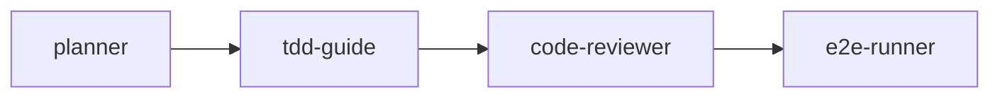
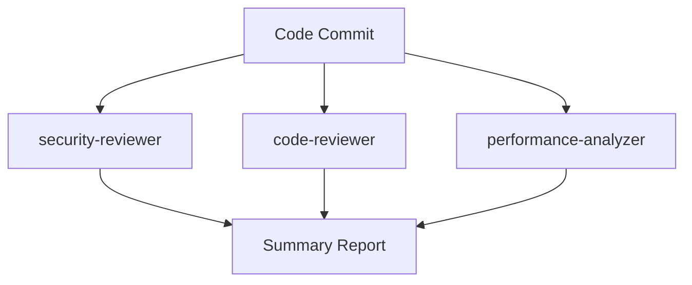
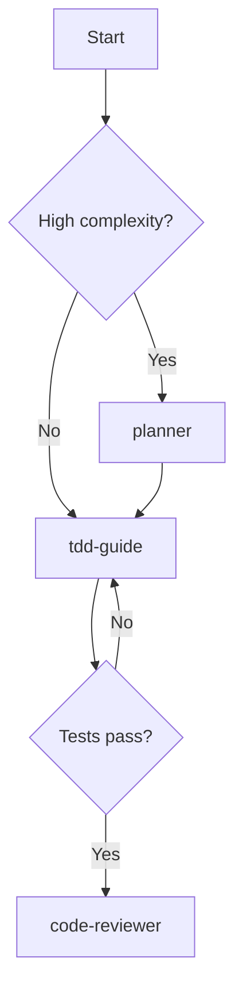

# 🎭 Multi-Agent Orchestration

Learn how to combine multiple agents into powerful workflows, like conducting an expert team working in concert.

## Why Multi-Agent?

A single agent is like a **solo expert**, while multi-agent orchestration is like **assembling a professional team**:

- 🏗️ **Planner** creates the plan
- 🧪 **TDD Guide** executes development
- 🔍 **Code Reviewer** reviews quality
- 🎯 **E2E Runner** verifies functionality

## Orchestration Patterns

### Pattern 1: Sequential Orchestration



**Use case**: Standard feature development workflow

```bash
# Sequential execution
/plan Implement shopping cart    # Step 1
/tdd --feature=cart              # Step 2
/code-review                     # Step 3
/e2e Test shopping flow          # Step 4
```

### Pattern 2: Parallel Orchestration



**Use case**: Multi-dimensional code review

### Pattern 3: Conditional Orchestration



**Use case**: Choosing different paths based on conditions

## Practical Examples

### Example 1: Full Feature Development

```bash
# 1. Requirements analysis and planning
/plan Implement a user authentication system

# After confirmation...

# 2. Architecture design (for complex features)
/architect Design auth architecture

# 3. TDD development
/tdd --feature="auth-login"
/tdd --feature="auth-register"
/tdd --feature="auth-logout"

# 4. Code review
/code-review src/auth/

# 5. Security audit
/security src/auth/

# 6. End-to-end testing
/e2e Test the complete auth flow

# 7. Performance check
/perf --module=auth
```

### Example 2: Bug Fix Workflow

```bash
# 1. Debug and analyze
/debug TypeError: Cannot read property 'user' of undefined

# 2. TDD fix (write reproduction test first)
/tdd --feature="fix-null-user"

# 3. Code review
/code-review

# 4. Regression testing
/e2e Test the affected flows
```

### Example 3: Large-Scale Refactoring

```bash
# 1. Architecture assessment
/architect Assess current architecture issues

# 2. Create a refactoring plan
/plan Refactor the data access layer

# 3. Parallel review of current code
# (Multiple agents working simultaneously)
/code-review src/repositories/
/security src/repositories/
/perf src/repositories/

# 4. Incremental refactoring
/tdd --feature="refactor-user-repo"
/tdd --feature="refactor-order-repo"

# 5. Comprehensive testing
/e2e Regression test all features
```

## Best Practices

### 1. Plan First

```bash
# ✅ Always plan complex features first
/plan Feature description

# ❌ Jump straight into coding
Start writing code directly...
```

### 2. Review Promptly

```bash
# ✅ Review code immediately after writing
/code-review

# ❌ Accumulate lots of code before reviewing
Write 1000 lines then review...
```

### 3. Automated Testing

```bash
# ✅ TDD ensures quality
/tdd --feature="feature"

# ❌ Write tests after completing the feature
Finish feature then add tests...
```

## Advanced Tips

### Parallel Task Execution

For independent tasks, run multiple agents in parallel:

```markdown
Launch 3 agents simultaneously:
1. Agent 1: Security review of auth module
2. Agent 2: Performance analysis of cache system
3. Agent 3: Type checking of utilities
```

### Multi-Perspective Analysis

For complex problems, use multiple roles for analysis:

- 👨‍💻 **Senior Engineer perspective**: Code quality
- 🔒 **Security Expert perspective**: Vulnerabilities
- ⚡ **Performance Expert perspective**: Bottlenecks
- 📝 **Documentation Expert perspective**: Maintainability

---

💡 **Tip**: The key to multi-agent orchestration is **clearly defining each agent's responsibility boundaries** to avoid duplicate work!
