# 🤖 Agents

**Agents** are the core components of ECC. Each agent is an expert in a specific domain, with specialized skills and workflows.

## What Are Agents?

Think of agents as your **professional team members**:
- 🏗️ **architect** is your system architect
- 📋 **planner** is your project manager
- 🧪 **tdd-guide** is your testing coach
- 🔍 **code-reviewer** is your code review expert

## Overview of 13 Agents

| Agent | Purpose | Trigger Command |
|-------|---------|-----------------|
| **planner** | Create implementation plans | `/plan` |
| **architect** | System design decisions | `/architect` |
| **tdd-guide** | Test-driven development | `/tdd` |
| **code-reviewer** | Code review | `/code-review` |
| **security-reviewer** | Security analysis | `/security` |
| **build-error-resolver** | Fix build errors | `/build-and-fix` |
| **e2e-runner** | End-to-end testing | `/e2e` |
| **refactor-cleaner** | Dead code cleanup | `/refactor` |
| **doc-updater** | Documentation updates | `/doc` |
| **git-assistant** | Git operations | `/git` |
| **debugger** | Debugging assistant | `/debug` |
| **performance-optimizer** | Performance optimization | `/perf` |
| **dependency-manager** | Dependency management | `/deps` |

## Key Agents in Detail

### 🏗️ planner - The Planner

**Role**: Create detailed implementation plans before writing code

**Workflow**:
1. Restate requirements to ensure understanding
2. Analyze risks and dependencies
3. Create a phased plan
4. **Wait for user confirmation** before starting execution

```bash
# Usage example
/plan Implement a user authentication system
```

### 🧪 tdd-guide - TDD Coach

**Role**: Guide you through test-driven development

**TDD Cycle**:
```
🔴 RED    → Write a failing test
🟢 GREEN  → Write minimum code to make it pass
🔵 REFACTOR → Refactor while keeping tests green
```

### 🔍 code-reviewer - Code Reviewer

**Role**: Review code quality and find potential issues

**Review Dimensions**:
- Code correctness
- Security vulnerabilities
- Performance issues
- Maintainability
- Best practices

## Agent Collaboration

Agents can work together to form workflows:

```mermaid
graph LR
    A["/plan"] --> B["planner 🏗️"]
    B --> C["/tdd"]
    C --> D["tdd-guide 🧪"]
    D --> E["/code-review"]
    E --> F["code-reviewer 🔍"]
    F --> G["/e2e"]
    G --> H["e2e-runner 🎯"]
```



## Best Practices

1. **Complex features** → Use `planner` first to create a plan
2. **New features / Bug fixes** → Use `tdd-guide` for TDD
3. **After coding** → Use `code-reviewer` for review
4. **Critical flows** → Use `e2e-runner` for end-to-end testing

---

💡 **Tip**: Agent configuration files are located in the `~/.claude/agents/` directory — you can customize them to fit your team's needs!
