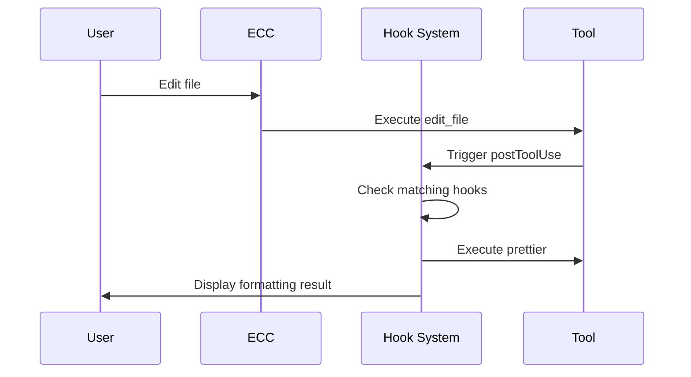

# 🪝 Hooks

**Hooks** are actions that execute automatically when specific events occur, automating repetitive tasks.

## What Are Hooks?

Hooks are like a **smart butler**:
- 📁 When a file is saved → Auto-format
- 🔨 When editing TypeScript → Auto type-check
- 🚫 When `console.log` is detected → Auto-warn

## Hook Types

### PostToolUse Hooks

**Triggered**: After a tool is used

| Hook | Trigger Condition | Action |
|------|-------------------|--------|
| `prettier` | After editing JS/TS files | Auto-format |
| `tsc-check` | After editing `.ts/.tsx` | TypeScript type checking |
| `eslint` | After editing JS/TS | ESLint checking |
| `console-warn` | File contains `console.log` | Issue a warning |

### PreCommit Hooks

**Triggered**: Before a Git commit

| Hook | Action |
|------|--------|
| `lint-staged` | Only check staged files |
| `type-check` | Full type checking |
| `test-affected` | Run affected tests |

### Stop Hooks

**Triggered**: Before a session ends

| Hook | Action |
|------|--------|
| `console-audit` | Check all modified files for `console.log` |
| `coverage-check` | Check test coverage |
| `security-scan` | Quick security scan |

## Configuring Hooks

Configure in `~/.claude/settings.json`:

```json
{
  "hooks": {
    "postToolUse": [
      {
        "name": "prettier",
        "trigger": "*.{js,ts,tsx,jsx}",
        "command": "npx prettier --write"
      },
      {
        "name": "console-warn",
        "trigger": "*.{js,ts}",
        "pattern": "console.log",
        "action": "warn"
      }
    ],
    "stop": [
      {
        "name": "console-audit",
        "command": "grep -r 'console.log' --include='*.ts'"
      }
    ]
  }
}
```

## Practical Use Cases

### Scenario 1: Auto-Formatting

```json
{
  "name": "auto-format",
  "trigger": "edit_file",
  "filePattern": "*.{ts,tsx}",
  "command": "npx prettier --write ${file}"
}
```

### Scenario 2: TypeScript Type Checking

```json
{
  "name": "tsc-check",
  "trigger": "edit_file",
  "filePattern": "*.{ts,tsx}",
  "command": "npx tsc --noEmit"
}
```

### Scenario 3: Forbid console.log

```json
{
  "name": "no-console",
  "trigger": "edit_file",
  "filePattern": "*.{ts,tsx}",
  "pattern": "console.log",
  "severity": "error",
  "message": "console.log is not allowed in production code!"
}
```

## Hook Execution Flow



## Best Practices

1. **Keep hooks lightweight** - Avoid time-consuming operations
2. **Be specific with triggers** - Avoid unnecessary executions
3. **Friendly error messages** - Help users understand issues
4. **Configurable toggles** - Allow temporary disabling

---

💡 **Tip**: Hooks are powerful tools for boosting development efficiency, but too many hooks can slow down your workflow — add them wisely!
