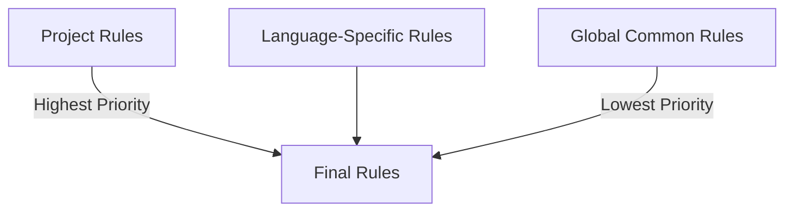

# 📏 Rules

**Rules** are guidelines that the AI must always follow to ensure code quality and team consistency.

## What Are Rules?

Rules are like **team conventions**:
- 🎨 Code style (indentation, naming, formatting)
- 🔒 Security standards (secret management, input validation)
- 🏗️ Architecture conventions (directory structure, layered design)
- 🧪 Testing requirements (coverage, testing strategy)

## Rule Hierarchy

### 1. Global Rules

Apply to all projects, configured in `~/.claude/rules/`:

```
~/.claude/rules/
├── common/
│   ├── coding-style.md
│   ├── security.md
│   └── testing.md
└── typescript/
    ├── coding-style.md
    └── patterns.md
```

### 2. Project Rules

Apply to specific projects, configured in the project root `.codebuddy/rules/`:

```
your-project/
└── .codebuddy/rules/
    ├── project-conventions.md
    └── api-design.md
```

## Core Rule Examples

### Coding Style Rules

```markdown
# TypeScript Coding Style

## Naming Conventions
- Variables/Functions: camelCase
- Classes/Interfaces: PascalCase
- Constants: UPPER_SNAKE_CASE
- File names: kebab-case.ts

## Prohibited
- ❌ Using the any type
- ❌ console.log in production code
- ❌ Hardcoded secrets or passwords
```

### Security Rules

```markdown
# Security Rules

## Secret Management
✅ CORRECT:
const apiKey = process.env.API_KEY

❌ WRONG:
const apiKey = "sk-xxxxx"

## Input Validation
- All user input must be validated
- Use Zod for schema validation
```

### Testing Rules

```markdown
# Testing Rules

## Coverage Requirements
- Core business logic: >= 80%
- Utility functions: >= 90%
- UI components: >= 70%

## Test Naming
describe('ComponentName', () => {
  it('should [expected behavior] when [condition]', () => {})
})
```

## Rule File Format

Rule files use Markdown format with the following structure:

```yaml
---
name: my-rule
priority: high
scope: typescript
---
```

**File content structure**:
- **# Rule Name** - Rule title
- **## Background** - Why this rule is needed
- **## Rule Content** - Specific rule descriptions
- **## Correct Examples** - Show correct code patterns
- **## Wrong Examples** - Show incorrect code patterns
- **## Exceptions** - When exceptions are allowed

## Rule Priority

Rules are applied in the following priority order:



1. **Project Rules** - Highest priority
2. **Language-Specific Rules** - Secondary priority
3. **Global Common Rules** - Baseline rules

## Installing Language Rule Packs

ECC provides pre-configured language rule packs:

```bash
# Install TypeScript rules
cp -r rules/typescript/* ~/.codebuddy/rules/

# Install Python rules
cp -r rules/python/* ~/.codebuddy/rules/

# Install Go rules
cp -r rules/golang/* ~/.codebuddy/rules/
```

## Best Practices

1. **Be specific** - Avoid vague descriptions
2. **Provide examples** - Show both correct and incorrect code
3. **Explain the why** - Explain why the rule exists
4. **Allow exceptions** - Clearly state when exceptions are acceptable
5. **Update regularly** - Update rules as the project evolves

---

💡 **Tip**: Good rules should be team consensus — it's recommended to discuss with the team before adding new rules!
