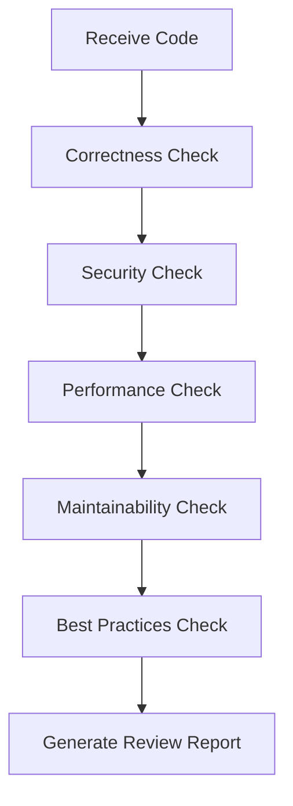

# 🎯 Skills

**Skills** are domain-specific best practice workflows that encapsulate expert-level knowledge and processes.

## What Are Skills?

Skills are like **expert recipes**:
- 📝 **Code review skill** - Knows what angles to review code from
- 🧪 **TDD skill** - Masters the rhythm of Red-Green-Refactor
- 🔒 **Security audit skill** - Understands common vulnerabilities and protections

## Skill Categories

### 🔍 Code Analysis Skills

| Skill | Description |
|-------|-------------|
| `code-review` | Multi-dimensional code review |
| `security-audit` | Security vulnerability scanning |
| `performance-analysis` | Performance bottleneck analysis |
| `complexity-check` | Code complexity checking |

### 🧪 Testing Skills

| Skill | Description |
|-------|-------------|
| `unit-test-design` | Unit test design |
| `integration-test` | Integration testing strategy |
| `e2e-test-flow` | End-to-end test flows |
| `coverage-analysis` | Coverage analysis |

### 🏗️ Architecture Skills

| Skill | Description |
|-------|-------------|
| `system-design` | System architecture design |
| `api-design` | API interface design |
| `database-design` | Database design |
| `microservices` | Microservice decomposition |

### 📝 Documentation Skills

| Skill | Description |
|-------|-------------|
| `api-documentation` | API documentation generation |
| `code-comments` | Code commenting standards |
| `readme-generation` | README generation |
| `changelog` | Changelog |

## Skill Workflow

Taking the **code review skill** as an example:



## Relationship Between Skills and Agents

- **Agent** = Expert role (e.g., "Code Reviewer")
- **Skill** = Specific capabilities the expert has (e.g., "Security Audit")

An agent can have multiple skills:

```
code-reviewer agent
├── code-review skill
├── security-audit skill
├── performance-analysis skill
└── best-practices skill
```

## Custom Skills

Create them in the `~/.claude/skills/` directory:

```markdown
---
name: my-custom-skill
description: My custom skill
---

# My Custom Skill

## Workflow
1. Step one
2. Step two
3. Step three

## Checklist
- [ ] Check item 1
- [ ] Check item 2
```

---

💡 **Tip**: Skills are composable — complex workflows can be built from multiple basic skills!
