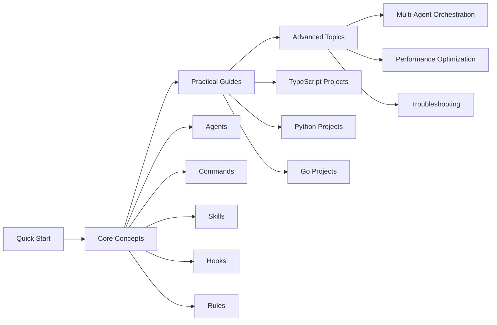

# 🚀 Welcome to Everything Claude Code

> **In a nutshell**: Turn Claude Code into your ultimate development partner!

## ✨ What is this?

**Everything Claude Code (ECC)** is a **production-grade** collection of Claude Code configurations, built by Anthropic Hackathon champions.

```bash
┌─────────────────────────────────────────────────────────┐
│  Your current development workflow:                     │
│  ❌ Manually searching docs                             │
│  ❌ Repeating the same instructions                     │
│  ❌ Inconsistent code style                             │
├─────────────────────────────────────────────────────────┤
│  After using ECC:                                       │
│  ✅ 13+ professional AI agents collaborating            │
│  ✅ 31+ slash commands at your fingertips               │
│  ✅ 28+ skills covering the full stack                  │
│  ✅ Automated hooks triggered intelligently             │
└─────────────────────────────────────────────────────────┘
```

## 🎯 Core Capabilities

| Component | Count | Purpose |
|-----------|-------|---------|
| 🤖 **Agents** | 13+ | Architect, Code Reviewer, Security Expert, TDD Coach... |
| ⚡ **Commands** | 31+ | `/plan`, `/tdd`, `/code-review`, `/build-fix`... |
| 📚 **Skills** | 28+ | Frontend, Backend, Python, Go, Security — full stack |
| 🎣 **Hooks** | 20+ | Intelligent automation for linting, formatting, etc. |
| 📏 **Rules** | Full coverage | TypeScript/Python/Go coding standards |

## 🚀 Get Started in 5 Minutes

### 1️⃣ Install the Plugin

```bash
# Add marketplace
codebuddy plugin marketplace add https://github.com/affaan-m/everything-claude-code

# Install plugin
codebuddy plugin install everything-claude-code@everything-claude-code
```

### 2️⃣ Install Rules

```bash
# Copy common rules
cp -r rules/common/* .codebuddy/rules/

# If you need TypeScript rules
cp -r rules/typescript/* .codebuddy/rules/
```

### 3️⃣ Let's Go!

```bash
# Try these superpowered commands
/plan "Add user authentication"
/tdd
/code-review
/build-fix
```

## 📚 Learning Path



## 💡 Core Concepts at a Glance

### 🤖 Agents - Your AI Team

Just like a restaurant has different roles, each agent has its own specialty:

| Agent | Role | Use Case |
|-------|------|----------|
| **planner** | Feature Planner | Create implementation plans, break down tasks |
| **architect** | System Architect | Tech stack decisions, architecture design |
| **code-reviewer** | Code Reviewer | Quality, security, maintainability checks |
| **security-reviewer** | Security Expert | Vulnerability analysis, security audits |
| **tdd-guide** | TDD Coach | Red-Green-Refactor cycle guidance |
| **e2e-runner** | E2E Tester | Playwright test generation and execution |

### ⚡ Commands - Slash Commands

Like activating superhero abilities, type `/` to summon various powers:

```bash
/plan "I need to add real-time notifications"  # Create an implementation plan
/tdd                                           # Start TDD workflow
/code-review                                   # Code review
/build-fix                                     # Auto-fix build errors
/e2e --url=http://localhost:3000              # E2E testing
```

### 📚 Skills - Domain-Specific Knowledge

Skills are workflow definitions containing best practices for specific domains:

- **frontend-patterns** - React/Next.js patterns and best practices
- **backend-patterns** - API, database, caching design patterns
- **python-patterns** - Pythonic idioms and best practices
- **django-patterns** - Django framework patterns
- **continuous-learning** - Auto-extract patterns from sessions
- **tdd-workflow** - Complete TDD methodology

### 🎣 Hooks - Automation Triggers

Hooks automatically execute actions when specific events occur:

- **SessionStart** - Load context when session begins
- **PreToolUse** - Intercept and check before tool usage
- **PostToolUse** - Format code after tool usage
- **Stop** - Check for console.log after each response

### 📏 Rules - Guidelines

Rules are guiding principles the AI must follow in **all tasks**:

- Coding style, immutability, file organization
- Commit format, PR workflow
- TDD, 80%+ coverage requirements
- Model selection, context management
- Design patterns, security checks

## 🎓 Understanding Through Analogies

| Concept | Analogy | Explanation |
|---------|---------|-------------|
| **Agents** | Expert Team | Different roles in a restaurant, each with their specialty |
| **Commands** | Quick Buttons | One-tap shortcuts on your phone |
| **Skills** | Playbooks | Domain-specific "recipe books" |
| **Hooks** | Smart Home | Automated triggers like smart home devices |
| **Rules** | Code of Conduct | Company employee handbook |
| **Contexts** | Work Modes | Actors switching costumes for different scenes |

## 🔥 Getting Started in Practice

### Example 1: /plan - Create a Plan

```bash
/plan "Implement a shopping cart with Stripe payment"
```

Output:
- ✓ Analyze requirements
- ✓ Create implementation plan
- ✓ Recommend relevant skills
- ✓ Break down task steps
- ✓ Wait for your confirmation before executing

### Example 2: TDD Red-Green-Refactor

```bash
/tdd --feature="user registration"
```

Follow the AI guidance to complete:
1. 🔴 RED - Write a failing test
2. 🟢 GREEN - Write minimal implementation to pass
3. 🔵 REFACTOR - Refactor the code
4. ✅ VERIFY - Ensure 80%+ coverage

### Example 3: Smart Code Review

```bash
# Auto-review before committing
/code-review

# Review specific files
/code-review --files="src/auth/*.ts"
```

## 🌟 Next Steps

Choose a topic to dive deeper into:

- 📖 [Quick Start Guide](quick-start/) - Complete installation and setup tutorial
- 🧠 [Core Concepts](core-concepts/) - Deep dive into Agents/Commands/Skills/Hooks/Rules
- 🛠️ [Practical Guides](guides/) - TypeScript/Python/Go project walkthroughs
- 🚀 [Advanced Topics](advanced/) - Multi-agent orchestration, performance, troubleshooting

---

**🎉 Ready for your ECC superpower journey? Let's get started!**
